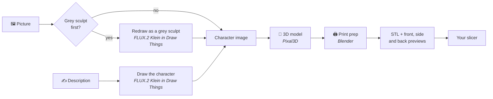
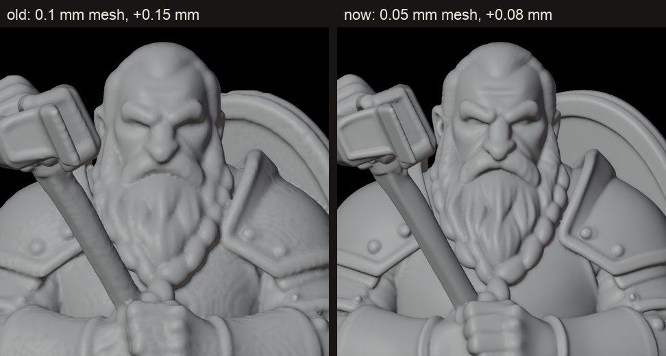

<p align="center"></p>

<h1 align="center">Mimic</h1>

<p align="center"><b>Turn any character into a miniature you can print.</b><br>
Drop in a picture, or describe your character, and Mimic makes a 3D-printable mini of it.<br>
Everything runs on your own Mac: no accounts, no uploads, no subscriptions.</p>


## 🚀 Get started

**What you need:**
- a Mac with an Apple chip (M1 or newer), running macOS 15 (Sequoia) or newer;
- about 25 GB of free space;
- an internet connection for the first install;
- a 3D printer, and Bambu Studio or another slicer.

1. **Download Mimic.** On this page, press the green **Code** button, then **Download ZIP**. Open the ZIP.
2. **Double-click `Install Mimic.command`.**
   - If your Mac says it can't check the file for malicious software, open
     **System Settings → Privacy & Security**, scroll down, and press **Open Anyway** next to
     *Install Mimic.command*.
   - The installer asks once before it starts, and may ask for your Mac password.
3. **Wait 20–60 minutes.** Most of that is downloading about 10 GB of AI models.
4. **Mimic opens by itself.** A short checklist walks you through the last two clicks in
   *Draw Things*, the free app Mimic uses to draw and redraw pictures.

After that, open **Mimic** from your Applications folder whenever you want to make a mini.

## 🧙 Making a mini


1. **Your character.** Drop in a picture, or switch to ✍️ **Describe it** and write a
   sentence. A full-body picture with a plain background works best. Leave *Turn it into a
   grey sculpt first* on for drawings and photos.
2. **Size & printer.**
   - Type how tall the character is and pick a scale; Mimic works out the size of the mini.
   - Pick your printer's nozzle. If you're not sure, it's 0.4 mm.
3. **✨ Make my mini** and wait about 7–10 minutes. Your Mac will be busy while it works.
4. **🖨️ Open in your slicer** and print. The print tips under the 3D view match your nozzle.

Changed your mind about the size? **🔁 Apply new size** remakes the print file in seconds.
Your character stays exactly the same. Don't want a mini any more? **🗑️ Delete** moves it to
the Trash, so a wrong click can be undone.

**⚙️ Settings** has three things:
- **Is everything set up?** A check of everything Mimic needs, with what to do about
  anything that's missing. A ⚠️ on the Settings button means something needs attention.
- **Open minis in.** Any slicer Mimic finds: Bambu Studio, OrcaSlicer, PrusaSlicer, Cura,
  Creality Print, ElegooSlicer, Anycubic and more. Or your Mac's default app for 3D files,
  which covers any other slicer.
- **Where your minis are saved.**

## 🖨️ Printing tips

| Nozzle | Layer height | Walls | What to expect |
|---|---|---|---|
| 0.2 mm | 0.06–0.08 mm | 3–4 | Sharp faces and small details; slow |
| 0.4 mm | 0.12 mm | 3 | Faces and weapons read clearly; fine hair gets softened |
| 0.6 mm | 0.2 mm | 2–3 | Quick and sturdy; best at 54 mm scale or bigger |

For every nozzle: supports on **Tree (auto)**, stand the mini upright on its base, no brim.

**Bigger shows more.** At 32 mm a face is about 5 mm tall. At 54 mm scale (about 6 cm for a
tall character) faces, small pets and props come out much better on a home printer.

## ⚠️ Good to know

- **Small companions and props**, like a bird on a shoulder, can come out as blobs. The AI
  sees them at only a few pixels and has to guess their far side.
- **Chunky, heroic-looking characters work best.** Realistic proportions make faces tiny.
- Pictures you make are yours to print. If you want to sell prints, check the licences at the
  bottom first.

---

## 🛠️ For developers

### How it works



1. **Image.** Optionally redrawn as a grey sculpt by FLUX.2 Klein through
   [Draw Things](https://drawthings.ai)' HTTP API (`pipeline/drawthings.py`, which pins the
   model and sampler).
2. **Mesh.** [Pixal3D](https://github.com/raven38/pixal3d.cpp) via
   [image-to-3dlab](https://github.com/Bingeljell/image-to-3dlab), on the Mac's GPU.
3. **Print prep** (`pipeline/mini_prep.py`, Blender):
   - scales the figure and centres it on the solid cross-sections of its lower body;
   - fuses it to a round base and rebuilds it as one watertight solid;
   - thickens thin parts by 0.4 × the nozzle, drops floating bits and slices the bottom flat;
   - exports the STL plus front, side and back renders.



### From a terminal

```bash
./make_mini.sh dwarf-cleric "dwarf cleric, warhammer held against chest"
./make_mini.sh tiefling --image art.png --restyle --height 38 --nozzle 0.2
SEED=7 ./make_mini.sh dwarf-cleric-2 "dwarf cleric, warhammer held against chest"
```

Flags after the description or image go to `mini_prep.py`: `--height`, `--base`,
`--base-height`, `--nozzle`, `--inflate`, `--voxel`, `--faces`, `--no-base` and `--flatten`.
Add `?run=<name>` to the page address to open a specific mini.

### Layout

| Path | What |
|---|---|
| `Install Mimic.command` / `setup.sh` | the installer (`setup.sh --yes`, `--build-from-source`) |
| `Mimic.command` | starts the app; the Mimic app in Applications runs it |
| `make_mini.sh` | the pipeline: image → mesh → print prep |
| `pipeline/` | `mini_prep.py` (Blender), `drawthings.py`, `gen_views.py` (multiview input, not wired in yet), `render_zoom.py` |
| `ui/` | the web app: `serve.py` (standard library only), `index.html`, logo and icon |
| `tools/package_pixal3d.sh` | builds the relocatable Pixal3D download the installer uses |
| `tests/` | `test_prep.sh` (print prep on a synthetic figure) and `test_serve.py` (input checks) |
| `runs/`, `image-to-3dlab/` | your minis, and the engine plus models (both git-ignored) |

### Tests

```bash
tests/test_prep.sh          # watertight, flat bottom, right height, centred, one piece
python3 tests/test_serve.py # the web app's input validation
```

### Releasing the Pixal3D engine

The installer downloads a pre-built Pixal3D so users never need Xcode. To rebuild it, see
the header of `tools/package_pixal3d.sh`. It must target macOS 14 and map the source path
away. Upload the tarball to a release, then update `PIXAL3D_URL` and `PIXAL3D_SHA256` in
`setup.sh`.

## Licences

- **Mimic:** MIT (see `LICENSE`).
- **Pixal3D (pixal3d.cpp) and ggml:** MIT. Their licence texts ship inside the engine download.
- **Pixal3D's model weights:** MIT, with the bundled DINOv3 image encoder under Meta's DINOv3
  licence.
- **FLUX.2 Klein:** Black Forest Labs' licence. Check it before selling prints of generated
  characters.
