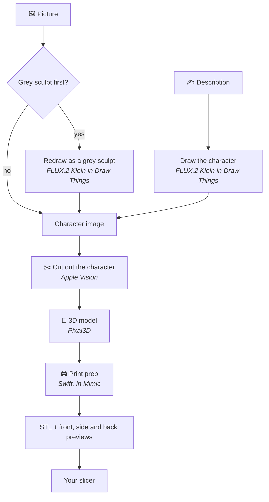

<p align="center"></p>

<h1 align="center">Mimic</h1>

<p align="center"><b>Turn any character into a miniature you can print.</b><br>
Drop in a picture, or describe your character, and Mimic makes a 3D-printable mini of it.<br>
Everything runs on your own Mac: no accounts, no uploads, no subscriptions.</p>


## 🚀 Get started

### What you need

- A Mac with Apple silicon (M1 or newer), on macOS 15 (Sequoia) or newer
- 32 GB of memory
- About 25 GB of free space
- A 3D printer, and a slicer for it, such as [Bambu Studio](https://github.com/bambulab/BambuStudio),
  [OrcaSlicer](https://github.com/OrcaSlicer/OrcaSlicer), [PrusaSlicer](https://github.com/prusa3d/PrusaSlicer)
  or [UltiMaker Cura](https://github.com/Ultimaker/Cura)
- Optional: [Draw Things](https://apps.apple.com/app/id6444050820), a free app. With it, Mimic
  can make a mini from a description, and turn your picture into a grey sculpt first, which
  gives better minis. Mimic shows you how to set it up.

### Install

1. Download the `.dmg` file from the [latest release](https://github.com/yonatankarp/mimic/releases/latest) and open it.
2. Drag **Mimic** onto **Applications**, then open Mimic from your Applications folder.
   If your Mac says it can't check Mimic, see the note below.
3. Press **Download**. The first time, Mimic downloads its 3D engine (8.1 GB). You can keep
   using your Mac while it does.

> [!IMPORTANT]
> **The first time you open Mimic, your Mac may say it can't check it.** Mimic is a free app
> that isn't registered with Apple, so it needs one extra step:
> 1. Press **Done** on that message.
> 2. Open **System Settings → Privacy & Security**.
> 3. Scroll down to *"Mimic was blocked"* and press **Open Anyway**.
> 4. Confirm with your Mac password or Touch ID.
>
> You only do this once.

## 🧙 Making a mini


1. Press **New Mini** (⌘N).
2. Drop in a picture of your character, or switch to **Describe it** and write a sentence.
3. Pick your printer's nozzle and how big to make it.
4. Press **Make My Mini** and wait about 7–10 minutes.
5. Press **Open in …** to open it in your slicer, and print. Each mini's page shows the slicer
   settings to use.

Want a fuller description from a few words? Choose an **AI helper for descriptions** in
Settings (Claude or another service with your own API key, or Ollama on your Mac), then press
**✨ Improve Description**. You can edit what it writes or go back to yours. It's off unless you
turn it on, and a cloud service only ever sees the description you typed.

> [!TIP]
> Mimic explains each choice as you make it. If something isn't set up, **Settings** (⌘,)
> tells you what's missing and how to fix it.

Your minis are saved in **Documents → Mimic**.

---

## 🛠️ For developers

### How it works



1. **The picture.** FLUX.2 Klein, running in Draw Things, draws your character from a
   description, or redraws your picture as a grey sculpt so it's easier to turn into 3D.
2. **The 3D model.** Apple's Vision framework cuts the character out of the picture, then
   [Pixal3D](https://github.com/raven38/pixal3d.cpp) builds a 3D model from it on your Mac's
   graphics chip.
3. **Print prep.** Mimic's own Swift code sizes the model, centres it on a round base, makes it
   one solid piece, thickens thin parts to suit your nozzle, and flattens the bottom so it
   sits on the print bed.

### From a terminal

The app is also a `mimic` command, with the same engine. To add it to your Terminal, open
**Settings → Use Mimic from Terminal** and paste the command it shows (it asks for your Mac
password once). Finish the app's first-launch download first: `make` and `retry` need it.

```bash
mimic make dwarf-cleric "dwarf cleric, warhammer held against chest"
mimic make tiefling --image art.png --restyle --height 38 --nozzle 0.2
mimic resize tiefling --height 32 --base 25
mimic retry tiefling
mimic list
```

| Option | What it does |
|---|---|
| `--image FILE` | Start from your own picture instead of a description |
| `--restyle` | Redraw that picture as a grey sculpt first |
| `--improve` | Let the AI helper chosen in Settings write a fuller description first |
| `--height MM` | How tall the character is, feet to top; the base adds about 2 mm |
| `--base MM` | Size of the round base |
| `--nozzle 0.2` / `0.4` / `0.6` | Your printer's nozzle |
| `--inflate MM` | Extra thickness for thin parts (set from the nozzle unless you give it) |
| `--no-base` | Keep the character's own base instead of adding a round one |
| `--seed N` | Try a different version of the same character |

Ctrl-C stops a mini and everything it started.

Want to change Mimic itself? See [CONTRIBUTING.md](CONTRIBUTING.md).

## Licences

- **Mimic:** MIT (see [LICENSE](LICENSE)).
- **Pixal3D:** MIT, except the image encoder its model includes, which uses Meta's DINOv3 licence.
- **FLUX.2 Klein:** Black Forest Labs' licence. Check it before selling prints of generated
  characters.
