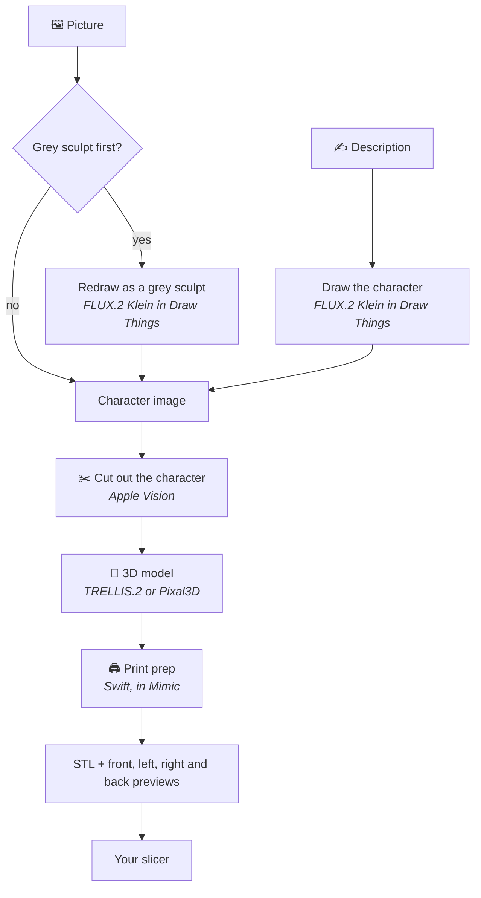

<p align="center"></p>

<h1 align="center">Mimic</h1>

<p align="center"><b>Turn any character into a miniature you can print.</b><br>
Drop in a picture, or describe your character, and Mimic makes a 3D-printable mini of it.<br>
Everything runs on your own Mac: no accounts, no uploads, no subscriptions.</p>


## 🚀 Get started

### What you need

- A Mac with Apple silicon (M1 or newer), on macOS 26 (Tahoe) or newer. Every such Mac can
  update to it for free, in System Settings → General → Software Update.
- 32 GB of memory
- About 25 GB of free space
- A 3D printer, and a slicer for it, such as [Bambu Studio](https://github.com/bambulab/BambuStudio),
  [OrcaSlicer](https://github.com/OrcaSlicer/OrcaSlicer), [PrusaSlicer](https://github.com/prusa3d/PrusaSlicer)
  or [UltiMaker Cura](https://github.com/Ultimaker/Cura)
- Optional: [Draw Things](https://apps.apple.com/app/id6444050820), a free app. With it, Mimic
  can make a mini from a description, and turn your picture into a grey sculpt first, which
  gives better minis. Mimic shows you how to set it up. Mimic connects to it through
  Draw Things' command line tool, which it downloads with its 3D engine, so Draw Things doesn't
  need to be open.

### Install

1. Download the `.dmg` file from the [latest release](https://github.com/yonatankarp/mimic/releases/latest) and open it.
2. Drag **Mimic** onto **Applications**, then open Mimic from your Applications folder.
   If your Mac says it can't check Mimic, see the note below.
3. Pick a 3D model (TRELLIS.2, the default, keeps what a figure holds most reliably; Pixal3D
   is faster, with the crispest surface) and press **Download**. The first time, Mimic
   downloads its 3D engine (8.3 to 9.3 GB, depending on the model). You can keep using your Mac while it does, and
   switch models later in Settings → 3D Model.

> [!IMPORTANT]
> **The first time you open Mimic, your Mac may say it can't check it.** Mimic is a free app
> that isn't registered with Apple, so it needs one extra step:
> 1. Press **Done** on that message.
> 2. Open **System Settings → Privacy & Security**.
> 3. Scroll down to *"Mimic was blocked"* and press **Open Anyway**.
> 4. Confirm with your Mac password or Touch ID.
>
> You only do this once.

## 🧙 Making a mini


1. Press **New Mini** (⌘N), and choose what you're making: 🧙 **A character** (a tabletop mini) or
   🏺 **Anything else** (a teapot, a car, a chess piece).
2. Drop in a picture of it, or switch to **Description** and write a sentence.
3. Pick your printer's nozzle and how big to make it.
4. Press **Make Mini**. A mini takes about 8–15 minutes, depending on the 3D model, and New
   Mini shows how long on your Mac. Keep using Mimic meanwhile: its progress is in the toolbar
   (click it for the steps, the queue and Stop), and Mimic tells you when it's ready. Closing the
   window doesn't stop it: it carries on in the Dock, which counts the minis ready to see.
5. Press **Open in …** to open it in your slicer, or drag one of its previews to Finder or any
   slicer, and print. Each mini's page shows the slicer settings to use.

**Several at once?** Press Make Mini while one is being made and the new one waits its turn.
Drop several pictures on New Mini to line up a mini for each. Your Mac stays awake until the
last one is done.

Want a fuller description from a few words? Choose an **AI helper for descriptions** in
**Settings → Draw Things & AI** (Claude or another service with your own API key, or Ollama on
your Mac), then press **Improve Description**. You can edit what it writes, or press **Use Original**.
It's off unless you turn it on, and a cloud service only ever sees the description you typed.

> [!TIP]
> Mimic explains each choice as you make it. If something isn't set up, **Needs Setup** appears
> in the toolbar: it opens **Settings** (Mimic → Settings, ⌘,), which tells you what's missing and how to fix it.

Your minis are saved in **Documents → Mimic**.

**Projects** group minis into folders, the same folders you see in Finder. Press **New Project**
at the bottom of the list (⇧⌘N), then drag minis onto it or right-click a mini → **Move to
Project**. New Mini puts a mini in the project you're looking at, or any one you pick.
Right-click a project → **Resize All…** to give every mini in it a new size at once.

A small detail came out as a blob? Right-click the mini → **Make Another Version…**: the same
picture and settings with a different variation number, next to it. Line up two or three:
the mini's page shows them side by side, and **Keep This One** moves the others to the Trash.

Something in the picture to fix, like a cape hiding the arms or a sword cut off? Say it in
**What to change**, in New Mini or Make Another Version: the picture is redrawn with your
change, and Mimic shows it to you before building the 3D shape (**Build Shape**, or **Try
Again** to draw it again). Each version made this way starts from the one before, so changes
add up, and the mini's details list them under Made From.

Want the same mini at two sizes, say one for the table and one for the shelf? Right-click it →
**Duplicate…**, name the copy, and choose its size. Only the size is made again: about a minute.

Playing online? Right-click a mini → **Export for Virtual Tabletop…** saves a low-poly `.glb`
of it (about 5,000 triangles) to drag into a virtual tabletop. It comes out grey (under 100 KB)
unless the mini was made from a colour picture with **Turn it into a grey sculpt first** off
(in Terminal, without `--restyle`): then the 3D engine paints it from your picture, back and
sides too, and the export keeps those colours (about 1.5 MB). The grey sculpt gives the
cleaner shape, so turn it off for the minis you want in colour.

Have a 3D model already, from another generator or HeroForge? **File → Import Model…**, pick the
GLB or STL file, and choose its sizes and base as for a new mini. Mimic makes it print-ready in
about a minute. It has no picture, so it can be resized and duplicated but not made again.

---

## 🛠️ For developers

### How it works



1. **The picture.** FLUX.2 Klein, running in Draw Things, draws your character from a
   description, or redraws your picture as a grey sculpt so it's easier to turn into 3D.
2. **The 3D model.** Apple's Vision framework cuts the character out of the picture, then
   [TRELLIS.2](https://github.com/microsoft/TRELLIS.2) (or Pixal3D, if you choose it in Settings),
   run by [pixal3d.cpp](https://github.com/raven38/pixal3d.cpp), builds a 3D model from it on
   your Mac's graphics chip.
3. **Print prep.** Mimic's own Swift code sizes the model, centres it on a base (round, square or hex), makes it
   one solid piece, thickens thin parts to suit your nozzle, and flattens the bottom so it
   sits on the print bed.

### From a terminal

The app is also a `mimic` command, with the same engine. To add it to your Terminal, choose
**Mimic → Install Command-Line Tool…**, copy the command it shows and paste it into Terminal (it asks
for your Mac password once).

```bash
mimic make "Dwarf Cleric" "dwarf cleric, warhammer held against chest"
mimic make tiefling --image art.png --restyle --height 38 --nozzle 0.2
mimic resize tiefling --height 32 --base 25
mimic list --json
```

Every command and option, JSON for scripts and completing as you type are in
[Mimic from a terminal](https://yonatankarp.github.io/mimic/cli), and `mimic --help` lists them too.

Want to change Mimic itself? See [CONTRIBUTING.md](CONTRIBUTING.md).

## Licences

- **Mimic:** MIT (see [LICENSE](LICENSE)). The app carries this licence and Sparkle's in
  `Mimic.app/Contents/Resources/Acknowledgements.txt`.
- **Sparkle:** MIT, with the notices of the code it includes. It's built into the app, for updates.
- **pixal3d.cpp and ggml:** MIT. The 3D engine, built from them; Mimic hosts the build that
  setup downloads, with both licences in it.
- **draw-things-cli:** GPL-3.0. Setup downloads it from Draw Things' own releases, and Mimic runs
  it as a separate program.
- **TRELLIS.2 and Pixal3D:** MIT, except the image encoder their models include, which uses
  Meta's DINOv3 licence.
- **FLUX.2 Klein:** Black Forest Labs' licence. Check it before selling prints of generated
  characters.
