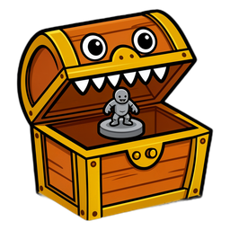
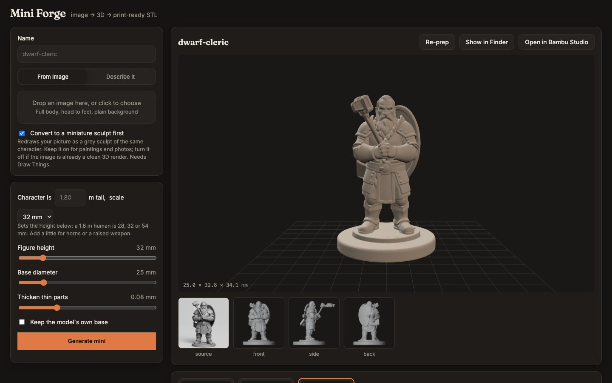
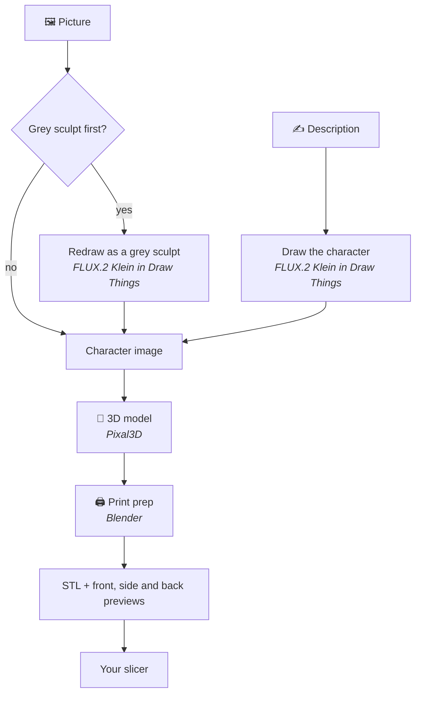

<p align="center"></p>

<h1 align="center">Mimic</h1>

<p align="center"><b>Turn any character into a miniature you can print.</b><br>
Drop in a picture, or describe your character, and Mimic makes a 3D-printable mini of it.<br>
Everything runs on your own Mac: no accounts, no uploads, no subscriptions.</p>


## 🚀 Get started

### Prerequisites

**Minimum hardware**
- A Mac with Apple silicon (M1 or newer), running macOS 15 (Sequoia) or newer
- 32 GB of memory (what Mimic is tested on)
- 25 GB of free disk space
- A 3D printer

**Install these yourself**

| What | What it's for | Get it |
|---|---|---|
| A slicer | Turns your mini into instructions for your printer | [Bambu Studio](https://github.com/bambulab/BambuStudio), [OrcaSlicer](https://github.com/OrcaSlicer/OrcaSlicer), [PrusaSlicer](https://github.com/prusa3d/PrusaSlicer), [UltiMaker Cura](https://github.com/Ultimaker/Cura) |
| FLUX.2 Klein | Draws and redraws character pictures. Only needed for ✍️ Describe it and the grey-sculpt step | Inside Draw Things' model list; Mimic's setup checklist shows where |

**The installer sets these up for you** (it uses any you already have)

| What | What it's for | Get it |
|---|---|---|
| Homebrew | Installs the tools below | [Homebrew/brew](https://github.com/Homebrew/brew) |
| Blender | Makes the print-ready file | [blender/blender](https://github.com/blender/blender) |
| Draw Things | Draws the pictures | [App Store](https://apps.apple.com/app/id6444050820) |
| git | Fetches Mimic's 3D engine | [git/git](https://github.com/git/git) |
| uv | Runs Mimic's 3D engine | [astral-sh/uv](https://github.com/astral-sh/uv) |
| Pixal3D and its 3D model (8.4 GB) | Turns a picture into a 3D model | [raven38/pixal3d.cpp](https://github.com/raven38/pixal3d.cpp) |

### Install

1. **Download Mimic.** On this page, press the green **Code** button, then **Download ZIP**. Open the ZIP.
2. **Double-click `Install Mimic.command`.**
   - If your Mac says it can't check the file for malicious software, open
     **System Settings → Privacy & Security**, scroll down, and press **Open Anyway** next to
     *Install Mimic.command*.
   - The installer asks once before it starts, and may ask for your Mac password.
3. **Wait 20–60 minutes.** Most of that is downloading about 10 GB of AI models.
4. **Mimic opens by itself.** A short checklist shows how to finish setting up *Draw Things*,
   the free app Mimic uses to draw and redraw pictures.

After that, open **Mimic** from your Applications folder whenever you want to make a mini.

## 🧙 Making a mini



> [!TIP]
> Chunky characters with bold shapes work best. Small details, like a pet on a shoulder,
> may come out soft.

1. **Your character.** Drop in a picture, or switch to ✍️ **Describe it** and write a
   sentence. A full-body picture with a plain background works best. Leave *Turn it into a
   grey sculpt first* on for drawings and photos.
2. **Size & printer.** Pick your printer's nozzle (if you're not sure, it's 0.4 mm), then
   what to size for:
   - **🎲 Game scale** matches the other minis on your table: type how tall the character is
     and pick the scale.
   - **✨ Best print** makes it big enough for faces to come out on your nozzle: about 64 mm
     on 0.2, 100 mm on 0.4 and 150 mm on 0.6.
3. **✨ Make my mini** and wait about 7–10 minutes. Your Mac will be busy while it works.
   **— Minimize** tucks the progress into the top bar; **⏹ Stop** cancels it.
4. **🖨️ Open in your slicer** and print. The print tips under the 3D view match your nozzle.

Changed your mind about the size? **🔁 Apply new size** remakes the print file in seconds.
Your character stays exactly the same. Don't want a mini any more? **🗑️ Delete** moves it to
the Trash, so a wrong click can be undone.

**🗂️ Your minis** lists everything you've made, newest first, with when each was made.
Search appears once you have more than six. Right-click a mini (or hover it and use **⋯**)
to open it in your slicer, show it in Finder, rename it, or move it to the Trash.

**⚙️ Settings** has three things:
- **Is everything set up?** A check of everything Mimic needs, with what to do about
  anything that's missing. A ⚠️ on the Settings button means something needs attention.
- **Open minis in.** Any slicer Mimic finds: Bambu Studio, OrcaSlicer, PrusaSlicer, Cura,
  Creality Print, ElegooSlicer, Anycubic and more. Or your Mac's default app for 3D files,
  which covers any other slicer.
- **Where your minis are saved.**

## 🖨️ Printing tips

| Nozzle | Layer height | Walls | What to expect |
|---|---|---|---|
| 0.2 mm | 0.06–0.08 mm | 3–4 | Sharp faces and small details; slow |
| 0.4 mm | 0.12 mm | 3 | Faces and weapons read clearly; fine hair gets softened. For game-size minis (28–32 mm), a 0.2 mm nozzle does much better |
| 0.6 mm | 0.2 mm | 2–3 | Quick and sturdy; best at 54 mm scale or bigger |

For every nozzle: supports on **Tree (auto)**, stand the mini upright on its base, no brim.

---

## 🛠️ For developers

### How it works



1. **The picture.** FLUX.2 Klein, running in Draw Things, draws your character from a
   description, or redraws your picture as a grey sculpt so it's easier to turn into 3D.
2. **The 3D model.** [Pixal3D](https://github.com/raven38/pixal3d.cpp), through
   [image-to-3dlab](https://github.com/Bingeljell/image-to-3dlab), builds a 3D model from the
   picture on your Mac's graphics chip.
3. **Print prep.** Blender sizes the model, centres it on a round base, makes it one solid
   piece, thickens thin parts to suit your nozzle, and flattens the bottom so it sits on the
   print bed.

### From a terminal

```bash
./make_mini.sh dwarf-cleric "dwarf cleric, warhammer held against chest"
./make_mini.sh tiefling --image art.png --restyle --height 38 --nozzle 0.2
```

| Option | What it does |
|---|---|
| `--image FILE` | Start from your own picture instead of a description |
| `--restyle` | Redraw that picture as a grey sculpt first |
| `--height MM` | How tall the character is, feet to top; the base adds about 2 mm |
| `--base MM` | Size of the round base |
| `--nozzle 0.2` / `0.4` / `0.6` | Your printer's nozzle |
| `--no-base` | Keep the character's own base instead of adding a round one |
| `SEED=7` before the command | Try a different version of the same character |

Want to change Mimic itself? See [CONTRIBUTING.md](CONTRIBUTING.md).

## Licences

- **Mimic:** MIT (see `LICENSE`).
- **Pixal3D:** MIT, except the image encoder its model includes, which uses Meta's DINOv3 licence.
- **FLUX.2 Klein:** Black Forest Labs' licence. Check it before selling prints of generated
  characters.
