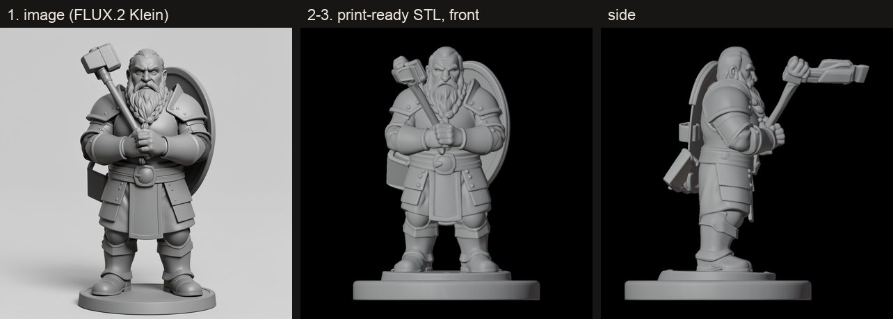
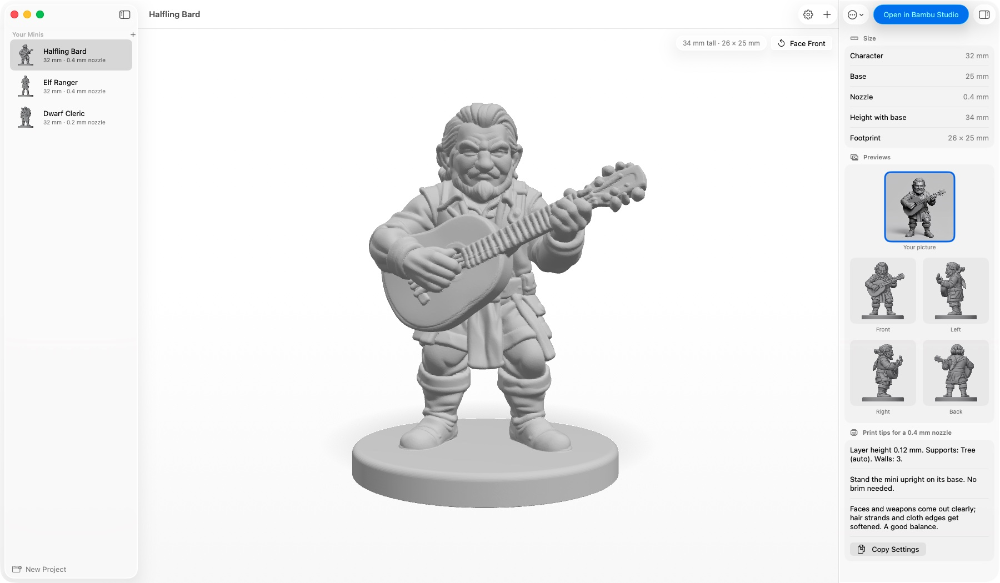
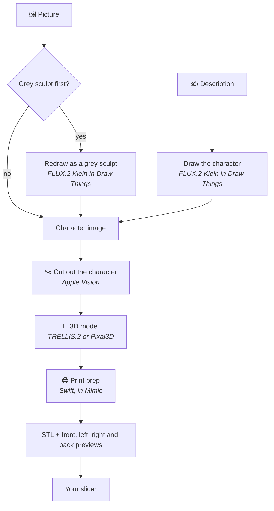

<p align="center"></p>

<h1 align="center">Mimic</h1>

<p align="center"><b>Turn any character into a miniature you can print.</b><br>
Drop in a picture, or describe your character, and Mimic makes a 3D-printable mini of it.<br>
Everything runs on your own Mac: no accounts, no uploads, no subscriptions.</p>



## 🚀 Get started

### What you need

- A Mac with Apple silicon (M1 or newer), on macOS 26 (Tahoe) or newer. Every such Mac can
  update to it for free, in System Settings → General → Software Update.
- 32 GB of memory
- About 25 GB of free space
- A 3D printer, and a slicer for it, such as [Bambu Studio](https://github.com/bambulab/BambuStudio),
  [OrcaSlicer](https://github.com/OrcaSlicer/OrcaSlicer), [PrusaSlicer](https://github.com/prusa3d/PrusaSlicer)
  or [UltiMaker Cura](https://github.com/Ultimaker/Cura)
- Optional: [Draw Things](https://apps.apple.com/app/id6444050820), a free app. With it, Mimic
  can make a mini from a description, and turn your picture into a grey sculpt first, which
  gives better minis. Mimic shows you how to set it up. Mimic connects to it through
  Draw Things' command line tool, which it downloads with its 3D engine, so Draw Things doesn't
  need to be open.

### Install

1. Download the `.dmg` file from the [latest release](https://github.com/yonatankarp/mimic/releases/latest) and open it.
2. Drag **Mimic** onto **Applications**, then open Mimic from your Applications folder.
   If your Mac says it can't check Mimic, see the note below.
3. Pick a 3D model (TRELLIS.2, the default, keeps what a figure holds most reliably; Pixal3D
   is faster, with the crispest surface) and press **Download**. The first time, Mimic
   downloads its 3D engine (8.3 to 9.3 GB, depending on the model). You can keep using your Mac while it does, and
   switch models later in Settings → 3D Model.

> [!IMPORTANT]
> **The first time you open Mimic, your Mac may say it can't check it.** Mimic is a free app
> that isn't registered with Apple, so it needs one extra step:
> 1. Press **Done** on that message.
> 2. Open **System Settings → Privacy & Security**.
> 3. Scroll down to *"Mimic was blocked"* and press **Open Anyway**.
> 4. Confirm with your Mac password or Touch ID.
>
> You only do this once.

## 🧙 Making a mini



1. Press **New Mini** (⌘N), and choose what you're making: 🧙 **A character** (a tabletop mini) or
   🏺 **Anything else** (a teapot, a car, a chess piece).
2. Drop in a picture of it, or switch to **Description** and write a sentence.
3. Pick your printer's nozzle and how big to make it.
4. Press **Make Mini**. A mini takes about 8–15 minutes, depending on the 3D model, and New
   Mini shows how long on your Mac. Keep using Mimic meanwhile: its progress is in the toolbar
   (click it for the steps, the queue and Stop), and Mimic tells you when it's ready. Closing the
   window doesn't stop it: it carries on in the Dock, which counts the minis ready to see.
5. Press **Open in …** to open it in your slicer, or drag one of its previews to Finder or any
   slicer, and print. Each mini's page shows the slicer settings to use.

**Several at once?** Press Make Mini while one is being made and the new one waits its turn.
Drop several pictures on New Mini to line up a mini for each. Your Mac stays awake until the
last one is done.

Want a fuller description from a few words? Choose an **AI helper for descriptions** in
**Settings → Draw Things & AI** (Claude or another service with your own API key, or Ollama on
your Mac), then press **Improve Description**. You can edit what it writes, or press **Use Original**.
It's off unless you turn it on, and a cloud service only ever sees the description you typed.

> [!TIP]
> Mimic explains each choice as you make it. If something isn't set up, **Needs Setup** appears
> in the toolbar: it opens **Settings** (Mimic → Settings, ⌘,), which tells you what's missing and how to fix it.

Your minis are saved in **Documents → Mimic**.

**Projects** group minis into folders, the same folders you see in Finder. Press **New Project**
at the bottom of the list (⇧⌘N), then drag minis onto it or right-click a mini → **Move to
Project**. New Mini puts a mini in the project you're looking at, or any one you pick.
Right-click a project → **Resize All…** to give every mini in it a new size at once.

A small detail came out as a blob? Right-click the mini → **Make Another Version**: the same
picture and settings with a different variation number, next to it. Line up two or three:
the mini's page shows them side by side, and **Keep This One** moves the others to the Trash.

Want the same mini at two sizes, say one for the table and one for the shelf? Right-click it →
**Duplicate…**, name the copy, and choose its size. Only the size is made again: about a minute.

Have a 3D model already, from another generator or HeroForge? **File → Import Model…**, pick the
GLB or STL file, and choose its sizes and base as for a new mini. Mimic makes it print-ready in
about a minute. It has no picture, so it can be resized and duplicated but not made again.

---

## 🛠️ For developers

### How it works



1. **The picture.** FLUX.2 Klein, running in Draw Things, draws your character from a
   description, or redraws your picture as a grey sculpt so it's easier to turn into 3D.
2. **The 3D model.** Apple's Vision framework cuts the character out of the picture, then
   [TRELLIS.2](https://github.com/microsoft/TRELLIS.2) (or Pixal3D, if you choose it in Settings),
   run by [pixal3d.cpp](https://github.com/raven38/pixal3d.cpp), builds a 3D model from it on
   your Mac's graphics chip.
3. **Print prep.** Mimic's own Swift code sizes the model, centres it on a base (round, square or hex), makes it
   one solid piece, thickens thin parts to suit your nozzle, and flattens the bottom so it
   sits on the print bed.

### From a terminal

The app is also a `mimic` command, with the same engine. To add it to your Terminal, choose
**Mimic → Install Command-Line Tool…**, copy the command it shows and paste it into Terminal (it asks
for your Mac password once). Finish the app's first-launch download first: `make` and `retry` need it.

```bash
mimic make dwarf-cleric "dwarf cleric, warhammer held against chest"
mimic make tiefling --image art.png --restyle --height 38 --nozzle 0.2
mimic resize tiefling --height 32 --base 25
mimic make teapot "a round teapot with a curved spout" --object --size 80
mimic retry tiefling
mimic make-another tiefling                        # the same, with a new seed: "tiefling-2"
mimic duplicate tiefling --as "Tiefling Display"   # the same shape, to resize without losing the first
mimic import "Ogre Chief.stl" --height 32          # print prep for a model made elsewhere (GLB or STL)
mimic make raven --image raven.png --project "Tiefling Party"
mimic move tiefling --project "Tiefling Party"     # or --unsorted
mimic projects
mimic list
```

| Option | What it does |
|---|---|
| `--image FILE` | Start from your own picture instead of a description |
| `--restyle` | Redraw that picture as a grey sculpt first |
| `--improve` | Let the AI helper chosen in Settings write a fuller description first |
| `--height MM` | How tall the character is, feet to top; the base adds about 2 mm |
| `--scale 28` / `32` / `35` / `54` / `75` | Match the scale your other minis use: sets the height and base for an average human (`--height` and `--base` still win) |
| `--base MM` | Size of the base: across it, or across the flat sides for a hex |
| `--base-shape round` / `square` / `hex` | The base's shape (round unless you give it; a resize keeps the mini's) |
| `--base-style plain` / `stone` / `wood` / `cobble` | A floor pressed into the top of the base: flagstones, planks or cobblestones (plain unless you give it; a resize keeps the mini's) |
| `--magnet 5x2` / `6x2` / `8x3` / `none` | A hole under the base for a round magnet this wide by this tall, in mm, with a little room to spare; the base gets taller to fit it (none unless you give it; a resize keeps the mini's) |
| `--nozzle 0.2` / `0.4` / `0.6` | Your printer's nozzle |
| `--inflate MM` | Extra thickness for thin parts (set from the nozzle unless you give it) |
| `--no-base` | Keep the character's own base instead of adding one |
| `--seed N` | Try a different version of the same character |
| `--project NAME` | Put it in that project (a new one is made if needed) |
| `--object` | Make anything that isn't a character: no base, sized by its longest side, set on its flat bottom |
| `--size MM` | How big it is: for an object, its longest side (set from the nozzle unless you give it); for a character, the same as `--height` |
| `--add-base` | Give an object a base too (sized to its shadow unless you give `--base`) |

Ctrl-C stops a mini and everything it started.

Want to change Mimic itself? See [CONTRIBUTING.md](CONTRIBUTING.md).

## Licences

- **Mimic:** MIT (see [LICENSE](LICENSE)).
- **TRELLIS.2 and Pixal3D:** MIT, except the image encoder their models include, which uses
  Meta's DINOv3 licence.
- **FLUX.2 Klein:** Black Forest Labs' licence. Check it before selling prints of generated
  characters.
