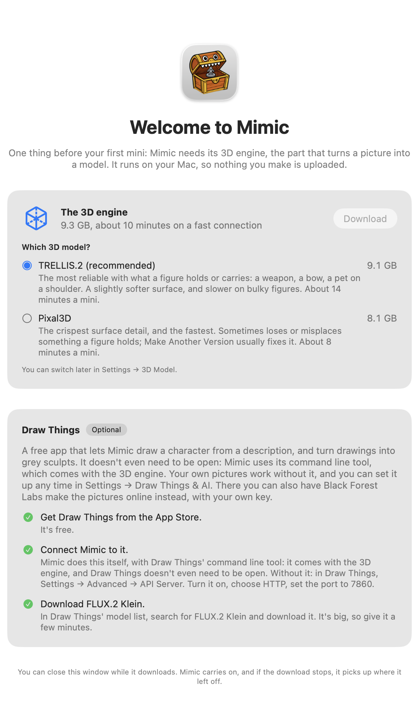

# Getting started

What you need, how to install Mimic, and what happens the first time you open it.

## What you need

- A Mac with Apple silicon (M1 or newer), on macOS 26 (Tahoe) or newer. Every such Mac can
  update to it for free, in System Settings → General → Software Update.
- 32 GB of memory. Mimic warns you before the download if your Mac has less: making a mini may
  be very slow or fail.
- About 25 GB of free space.
- A 3D printer, and a slicer for it, such as [Bambu Studio](https://github.com/bambulab/BambuStudio),
  [OrcaSlicer](https://github.com/OrcaSlicer/OrcaSlicer),
  [PrusaSlicer](https://github.com/prusa3d/PrusaSlicer) or
  [UltiMaker Cura](https://github.com/Ultimaker/Cura).
- Optional: [Draw Things](https://apps.apple.com/app/id6444050820), a free app. With it, Mimic
  can make a mini from a description, and turn your picture into a grey sculpt first, which gives
  better minis. See [Set up Draw Things](#set-up-draw-things). Or, instead of Draw Things, an
  account with Black Forest Labs or OpenAI, which make those pictures online.

Mimic needs no account and uploads nothing: everything runs on your Mac, unless you choose online
pictures or a cloud AI helper in Settings. [Privacy](how-it-works.md#privacy) says what each one
gets.

## Install Mimic

1. Download the `.dmg` file from the
   [latest release](https://github.com/yonatankarp/mimic/releases/latest) and open it.
2. Drag **Mimic** onto **Applications**.
3. Open Mimic from your Applications folder.

### With Homebrew

If you use [Homebrew](https://brew.sh), you can install Mimic with one command in Terminal instead
of steps 1 and 2:

```bash
brew install --cask yonatankarp/mimic/mimic
```

It puts Mimic in your Applications folder and adds the [`mimic` command](cli.md) to Terminal.
Then open Mimic from your Applications folder. The first time, your Mac may still say it can't
check it: see below. Mimic [keeps itself up to date](#keep-mimic-up-to-date), so you don't need
`brew upgrade`.

### If your Mac says it can't check Mimic

The first time you open Mimic, your Mac may say it can't check it ("Apple could not verify
Mimic"). That's because Mimic is a free app that isn't registered with Apple. It needs one extra
step, once:

1. Press **Done** on that message.
2. Open **System Settings → Privacy & Security**.
3. Scroll down to "Mimic was blocked" and press **Open Anyway**.
4. Confirm with your Mac password or Touch ID.

The disk image has the same steps in a file called "If Mimic won't open".

Your Mac may also ask whether Mimic can use your Documents folder, where your minis are kept. Allow
it.

## Choose a 3D model and download it

The first time you open it, Mimic shows **Welcome to Mimic**: before your first mini, it needs its
3D engine, the part that turns a picture into a model. It runs on your Mac, so nothing you make is
uploaded.

{ width="580" }

1. Under **Which 3D model?**, choose one:
    - **TRELLIS.2 (recommended)**: the most reliable with what a figure holds or carries, like a
      weapon, a bow or a pet on a shoulder. About 14 minutes a mini. 9.1 GB.
    - **Pixal3D**: the crispest surface detail, and the fastest. About 8 minutes a mini. 8.1 GB.
2. Press **Download**.

The download is the model, plus the 3D engine and Draw Things' command line tool: 9.3 GB in all with
TRELLIS.2, or 8.3 GB with Pixal3D, as **The 3D engine** says above the choice. The window shows
how much is done, the speed and the time left. You can keep using your Mac meanwhile, and close the
window: Mimic carries on. Quitting Mimic asks first, as it stops the download. If the download
stops, press **Try Again**: it picks up where it left off.

Not sure which model? Take TRELLIS.2. You can download the other, or switch, any time in
**Settings → 3D Model**. [Choose a 3D model](pictures.md#choose-a-3d-model) compares them.

## Set up Draw Things

Draw Things is optional. Your own pictures work without it. With it, Mimic can also:

- make a mini from a **description**, by drawing it first,
- turn your picture into a **grey sculpt** first, which gives cleaner minis,
- make minis from **cartoons**,
- redraw a picture with **what to change**, like "close the cape so both arms show".

The welcome window lists three steps, and ticks each one off as it's done:

1. **Get Draw Things from the App Store.** It's free.
2. **Connect Mimic to it.** Mimic does this itself, with Draw Things' command line tool, which comes
   with the 3D engine. Draw Things doesn't even need to be open.
3. **Download FLUX.2 Klein.** In Draw Things' model list, search for FLUX.2 Klein and download it.
   It's big, so give it a few minutes.

You can do this any time: the same steps are in **Settings → Draw Things & AI**.

!!! tip "Rather not install Draw Things?"
    In **Settings → Draw Things & AI**, set **Make pictures with** to **Black Forest Labs, online**
    or **OpenAI, online**, and save your API key from that service. The pictures are then made
    online, on your account, and Draw Things isn't needed. Your description, or the picture to
    redraw, is sent to that service, and each picture is one paid request. See
    [Choose what makes the pictures](settings.md#choose-what-makes-the-pictures).

??? note "Without the command line tool"
    If Mimic's copy of the command line tool is missing, Mimic talks to Draw Things directly
    instead. In Draw Things, open Settings → Advanced → API Server, turn it on, choose HTTP and set
    the port to 7860. With **Open Draw Things when needed** on, in **Settings → General**, Mimic
    opens Draw Things in the background when a mini needs a picture, and quits it afterwards if it
    opened it.

## Take the tour

Once the download is done, a short tour shows you around, in five stops on the real buttons:
welcome, starting a new mini, making it, a finished mini, and Settings.

To learn by doing, press **Use the Sample** at the second stop: New Mini opens with a sample
picture of a dwarf, ready to make. Press **Make Mini**: its progress opens in the toolbar, and the
tour carries on when you close that.

Press **Skip Tour** (or ++esc++) to leave it. To see it again, choose **Help → Show Tour**.

## Find your way around


- On the left, your minis, grouped into projects.
- In the middle, the mini you picked, in 3D. Drag it to turn it around.
- On the right, its size, filament, previews, versions, how it was made and print tips. Hide
  or show this panel with **Show Details** in the toolbar.
- In the toolbar, **New Mini**, the progress of the mini being made, and **Open in** your
  slicer.

Mimic explains each choice as you make it: hover over one for a tip. If something isn't set up,
**Needs Setup** appears in the toolbar. Click it to open Settings, which says what's missing and
how to fix it.

**Settings** is in the Mimic menu (++cmd+comma++). In **Settings → General**, under
**Open minis in**, choose the slicer **Open in** sends your minis to. Mimic lists the slicers it
finds on your Mac. [Settings](settings.md) explains every tab.

Your minis are kept in **Documents → Mimic**, the same folders you see in Finder.

Now [make your first mini](making-a-mini.md).

## Keep Mimic up to date

Each time you open Mimic, it checks for a new version. When there is one, a window shows it a few
seconds later, with what's new: click **Install Update**. Mimic checks that the update really
comes from its makers, installs it and opens again. **Remind Me Later** leaves a small note in the
toolbar, like "Mimic 0.12.0 is available", and asks again next time you open Mimic; **Skip This
Version** stops Mimic showing that version when it opens, though checking yourself still shows it.

To check yourself, choose **Mimic → Check for Updates…**.

Mimic never installs an update while a mini is being made or waiting in the queue. The note then
says it installs when the queue is done, and it does. If Mimic is asking you something then, or
showing a window to save a file, the update waits until you've answered.

To stop Mimic checking when it opens, open **Settings → General** and, under **Updates**, turn off
**Check for updates when Mimic opens**. **Check Now** checks straight away. Only public release
information is read; nothing about your Mac or your minis is sent.

## Use Mimic from Terminal

Mimic is also a `mimic` command, with the same engine as the app. To add it to Terminal:

1. Finish the first download.
2. Choose **Mimic → Install Command-Line Tool…**.
3. Press **Copy Command**, paste it into Terminal and press Return. It asks for your Mac password,
   once.

If you installed Mimic with Homebrew, `mimic` is already there: skip these steps.

Then type `mimic` to make minis from there. Every command is in
[Mimic from a terminal](cli.md).
