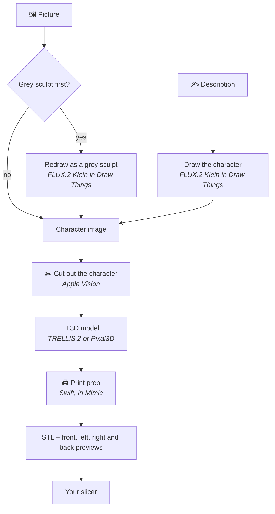

# How it works

From a picture or a description to a print-ready STL, everything happens on your Mac. This page
follows a mini through Mimic's three steps, compares the two 3D models, and lists exactly what Mimic
downloads and when it talks to the internet.

## The pipeline

Every mini is a job of three steps, the ones the progress popover counts and the mini's log
records:

| Step | Shown as | Runs | Makes |
|---|---|---|---|
| 1 | Getting the picture ready | Mimic itself, and Draw Things when a picture is drawn | `source.png` |
| 2 | Building the 3D shape | `mimic _engine`: Apple Vision, then the 3D engine | `model.glb` |
| 3 | Making the print-ready file | `mimic _prep`: print prep | `<name>.stl` and its previews |

Steps 2 and 3 are Mimic's own binary, started again as a separate program, so **Stop** ends a step
and everything it started at once. `_engine` is internal; `_prep` can be
[run by hand](print-prep.md#run-it-by-hand) to experiment. Each job runs
in a process group of its own, at a lower priority (`nice 10`), so your Mac stays quick to use
while a mini is made. A step whose file is already there is skipped, which is how **Try Again**
carries on from the step that failed and a mini stopped by quitting carries on at the next launch.

## Step 1: the picture

What happens depends on what you started from:

- **Your picture, as it is.** It's copied. Pictures are tidied once, when they're added: turned
  upright and made no larger than 2048 pixels on their longest side, so a 48-megapixel phone photo
  doesn't slow every step down.
- **Your picture as a grey sculpt** (**Turn it into a grey sculpt first**, `--restyle`). FLUX.2 Klein
  redraws it as an unpainted grey miniature: same character, pose and gear, bold readable shapes,
  feet on the ground, plain grey background. The 3D engine understands that far better than
  colours, shading and a busy background. A cartoon always gets the sculpt.
- **A description.** FLUX.2 Klein draws a full-body tabletop miniature of it, 1024 × 1024, front
  view, grey, on a plain background, with limbs and weapons held close to the body. Anything that
  isn't a character gets a neutral prompt for one whole object at eye level instead.
- **What to change.** The redraw is told to make that one change and keep everything else. In the
  app the job then stops so you can check the picture before the slow 3D step (**Build Shape**);
  in Terminal it carries straight on.

The variation number is the seed: the same description and number draw the same picture.

FLUX.2 Klein is Black Forest Labs' image model, run by
[Draw Things](https://apps.apple.com/app/id6444050820), a free Mac app. You download the model
inside Draw Things. Mimic talks to it in one of two ways:

1. **Draw Things' command line tool** (`draw-things-cli`), which Mimic downloads with its 3D engine.
   It runs as a program of Mimic's own, so Draw Things doesn't need to be open and its API server
   doesn't matter. The pinned version only ever generates on your Mac.
2. **Draw Things' API server**, at `http://127.0.0.1:7860` on your Mac, only when the command line
   tool isn't there. Mimic opens Draw Things in the background when it needs a picture (unless
   **Open Draw Things when needed** is off) and quits it afterwards if it opened it.

Every request names the model and its settings (4 steps, the sampler FLUX.2 Klein was made for), so
another kind of model selected in Draw Things can't take over. When you have more than one FLUX.2
Klein downloaded, Mimic uses the one selected in Draw Things, else the largest.

## Step 2: the 3D shape

**The cut-out.** Apple's Vision framework cuts the character out of the picture, then the edges'
colours are pulled in from the character so there's no halo. It takes under a second. Compared with
the cut-outs Mimic used before, Vision kept the elf's bow tips and the dwarf's whole hammer head. A
picture that's already cut out (at least 2% of it transparent) is used as it is.

**The 3D engine** is [pixal3d.cpp](https://github.com/raven38/pixal3d.cpp), a C++ program
(`trellis-cli`) built with ggml for your Mac's graphics chip (Metal). It runs both 3D models:

- **[TRELLIS.2](https://github.com/microsoft/TRELLIS.2)**, Microsoft's model, at its own defaults,
  1024 resolution. With pictures of the back and sides, its multi-image mode takes 2 to 8 cut-out
  pictures, front first.
- **Pixal3D**, the single-view model, with the settings Mimic was tuned on: a 20° camera, structure
  guidance 10 (the default 7.5 dropped a sword blade; 13 detached thin parts), 1024 resolution. It
  builds figures facing the other way from TRELLIS.2, so print prep turns them round to face the
  front, as your slicer shows it.

Both run with 8 sampling steps rather than the stock 12: the same shape, 16 to 31% faster. If an
engine build ever ignored that, Mimic stops it at once rather than let it run the slow way, and asks
for a Repair. TRELLIS.2's multi-image mode is the exception: it always runs its own 12 steps, so a
mini made from several pictures takes longer.

## Step 3: print prep

Mimic's own Swift code sizes the model, centres it on a base (round, square or hex), makes it one
watertight solid, thickens thin parts to suit your nozzle, flattens the bottom so it sits on the
print bed, and draws the four previews. It takes seconds. [Tuning print prep](print-prep.md) has
every step and option.

## The 3D models

You choose one when Mimic first downloads its engine, and can switch any time in
[Settings → 3D Model](settings.md#3d-model).

| | TRELLIS.2 (the default) | Pixal3D |
|---|---|---|
| Download | 9.1 GB (9.3 GB with the engine, the first time) | 8.1 GB (8.3 GB the first time) |
| A whole mini takes about | 14 minutes | 8 minutes |
| Good at | What a figure holds or carries: a weapon, a bow, a pet on a shoulder | The crispest surface detail, and speed |
| Less good at | A slightly softer surface; slower on bulky figures | Sometimes loses or misplaces something a figure holds |
| Pictures of the back and sides | Yes | No: one picture |
| Most memory any step used (measured) | 6.9 GB | 5.1 GB |
| ID (for `--model`, `mimic models`) | `trellis2-q8` | `pixal3d-sv` |

The times were measured on an M2 Max with 32 GB. Once you've made a few minis, Mimic's estimates use
your own Mac's times instead. Both are 8-bit (q8) versions of the models.

Why TRELLIS.2 is the default: pictures of figures holding or carrying something (the dwarf's hammer
and shield, the elf's bow, the halfling's lute, the tiefling's raven) were run through both models
with several variation numbers and judged from the side and back. TRELLIS.2 got the held part right
9 times out of 9, Pixal3D 4 out of 10: bows lost when they weren't joined to the hands, the raven a
blob from behind, the hammer pushed out in front.

**Cartoons are always made with Pixal3D**, so **It's a cartoon** needs Pixal3D downloaded. From the grey sculpt of a flat 2D cartoon, TRELLIS.2 builds
the figure out of flat panels, already in its own output, and smoothing afterwards didn't fix it.
Pixal3D's comes out smooth.

**The two share files.** Four of TRELLIS.2's files are byte for byte Pixal3D's (2.2 GB), so with one
downloaded, the other copies them instead of downloading them again, and they take no extra space.

## What runs where

| Part | Where it runs | Where it comes from |
|---|---|---|
| Mimic, the app and `mimic` | Your Mac | [Mimic's releases](https://github.com/yonatankarp/mimic/releases) |
| Draw Things and FLUX.2 Klein | Your Mac | The Mac App Store, and Draw Things' own model list |
| `draw-things-cli` | Your Mac | Draw Things' own GitHub release, `v1.20260430.0` |
| The cut-out | Your Mac (Apple Vision) | Built into macOS |
| The 3D engine, `trellis-cli` | Your Mac's graphics chip | Mimic's GitHub release `pixal3d-d1b4926`, built from pixal3d.cpp by Mimic |
| TRELLIS.2's model files | Your Mac's graphics chip | Hugging Face, [`ilintar/trellis2-gguf`](https://huggingface.co/ilintar/trellis2-gguf) |
| Pixal3D's model files | Your Mac's graphics chip | Hugging Face, [`raven38/pixal3d-sv-q8_0-v1`](https://huggingface.co/raven38/pixal3d-sv-q8_0-v1) |
| Print prep and previews | Your Mac | Built into Mimic |
| The AI helper, if you choose one | The service you choose, or Ollama on your Mac | You |

Everything Mimic downloads is **pinned**: each file has a fixed address (on Hugging Face, a fixed
revision of the repository), its size and its SHA-256 written into Mimic. A file that doesn't match
is deleted and downloaded again. Downloads resume where they stopped, and a file that's already
there and right is kept. A new version of Mimic that pins a newer engine shows the engine check as
needing **Repair**.

The model files' licences come with them: see [Licences](licences.md).

## Privacy

Mimic runs on your Mac: no account, no uploads, no subscription. Your pictures and minis never leave
it, and neither do your descriptions unless you choose a cloud AI helper (below). Mimic only goes
online for these:

- **First-launch setup, and downloads you ask for in Settings:** the engine from Mimic's GitHub
  release, `draw-things-cli` from Draw Things' GitHub release, and the model files from Hugging
  Face. Mimic only downloads from them.
- **Checking for updates:** once a day (unless you turn it off), and when you choose **Check for
  Updates…**, Mimic reads the latest release's public information from GitHub. Nothing about your
  Mac or your minis is sent.
- **An AI helper, only if you choose a cloud one** in Settings: it receives the description you
  type, and what you type in **What to change**, nothing else. Its key stays in your Keychain and is
  only sent to the address it was saved for. Ollama runs on your Mac, so with it nothing leaves.
- **Report a Problem** makes a file on your Mac and opens GitHub's form in your browser, and so
  does the report Mimic offers after it quits unexpectedly. Nothing is sent unless you attach the
  file and send the form yourself.

Mimic's time estimates are learned from your own minis and kept on your Mac only. See
[Where your files are](files.md) for everything it keeps.
