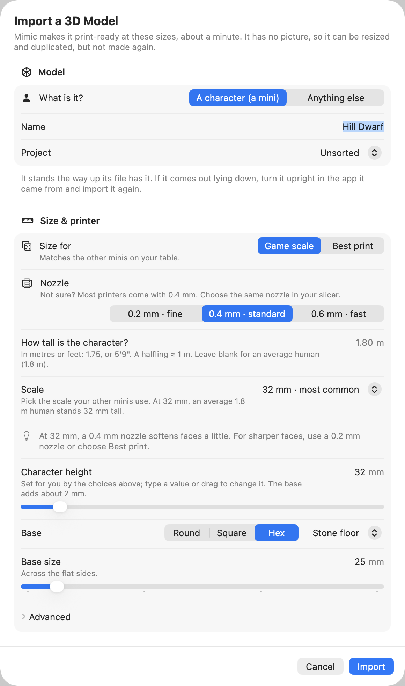

# Importing a model

Have a 3D model already, from another generator, a sculpting app or HeroForge? Mimic can make it
print-ready the same way it does its own minis: sized, on a base, as one solid piece, with thin
parts thickened for your nozzle.

## Import a GLB or STL file

1. Choose **File → Import Model…** (++cmd+shift+i++).
2. Pick a GLB or STL file and press **Import**.
3. In **Import a 3D Model**, choose **What is it?**: **Character** or **Object**.
4. Check its **Name** (taken from the file's) and its **Project**.
5. Choose its sizes and base, as for a new mini.
6. Press **Import**.

{ width="290" }

Only the print-ready step runs, so it's quick: about a minute, and the sheet says how long. It
needs no picture and no Draw Things. Its progress shows in the toolbar
as "Importing", and if another mini is being made, it waits its turn in [the queue](queue.md).

**Import Model…** is ready once Mimic's first download is done.

If Mimic can't use the file, Import says why: for example that it's damaged, or isn't really a GLB
or STL. A GLB too big for Mimic to read says "That model is too big for Mimic to read. Try a
simpler one, with fewer triangles." Export a lighter version from the app it came from, and import
that.

## What Mimic does with it

Mimic treats the model as it would its own 3D shape:

- **A character** is sized by its height, feet to top, and stands on a base: round, square or hex,
  with a floor and a magnet hole if you like. Or keep the model's own base, under **Advanced**.
- **An object** is sized by its longest side and stands on its own flat bottom, with no base
  unless you add one. One that would fall over is set on a steadier side.

[Sizes and bases](sizes-and-bases.md) explains every choice. Mimic then makes one solid piece,
thickens thin parts to suit your nozzle, flattens the bottom so it sits on the print bed, and draws
its previews.

An STL file is read as millimetres, but that hardly matters: Mimic sizes the model to what you
asked for anyway.

!!! warning "If it comes out lying down"
    Mimic takes "up" from the file: it can't tell from the shape which way up a model should be.
    Check the 3D view and the previews. If it's on its back or side, turn it upright in the app it
    came from, export it again and import that.

## What you can do with an imported mini

An imported mini is a mini like any other, with a few things missing: it has no picture or
description of its own.

You can:

- open it in your slicer, print copies of it, and drag it out,
- **Resize This Mini…**, or resize it with others,
- **Duplicate…** it, to keep it at two sizes,
- rename it, move it to another project, and move it to the Trash,
- **Export for Virtual Tabletop…**, in grey.

You can't make it again: **Try Again**, **Make Another Version…**, **New 3D Shape…** and
**Edit & Make Again…** are off, and say why. Its **Made from** details say it's a 3D model you
imported.

If its print-ready step fails, its page offers **Resize This Mini…** instead of Try Again: try
other sizes, or check the model in the app it came from. If Mimic quit unexpectedly while importing
it, its page says "Mimic stopped while making it. Resize it to try again." Stop an import before
its first print file is made, or remove it from the queue, and it goes to the Trash.

## Import in Terminal

`mimic import` does the same, with the same size options as `mimic make`. See
[Mimic from a terminal](cli.md).
