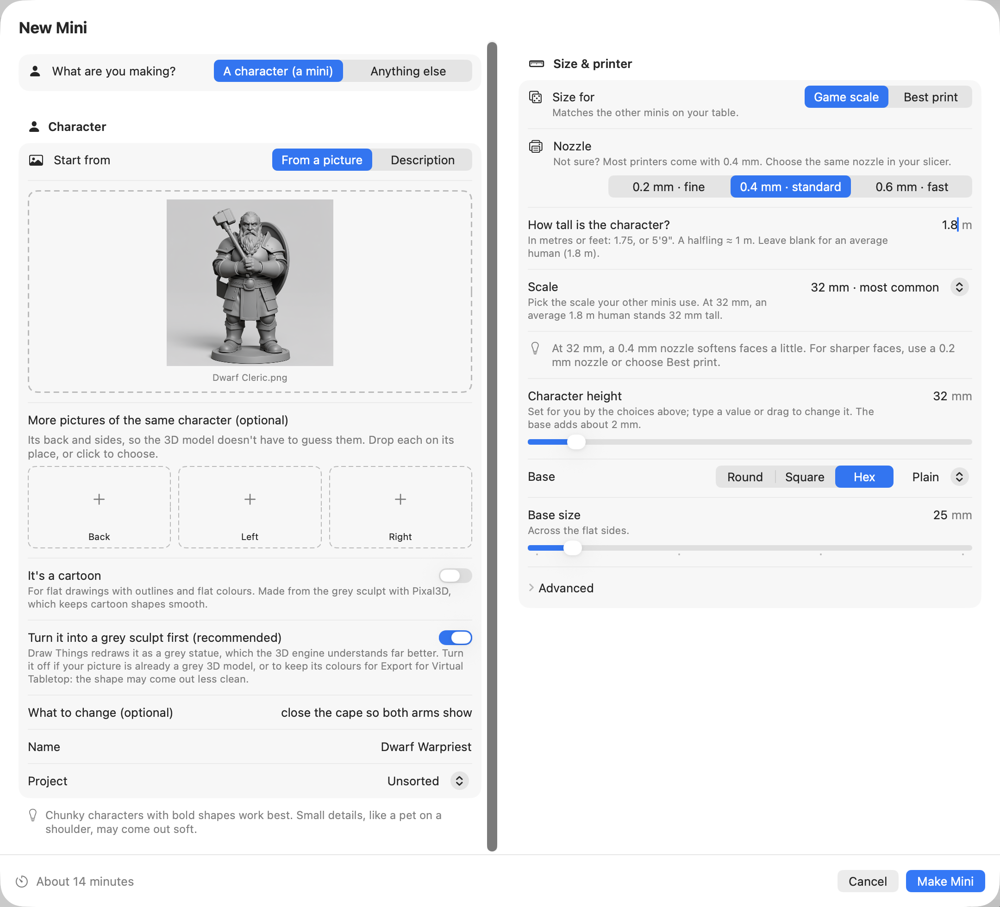

# Making a mini

Everything about **New Mini**, from opening it to a mini that's ready to print. If you haven't set
Mimic up yet, start with [Getting started](getting-started.md).

## Make a mini, step by step

1. Press **New Mini** in the toolbar, or ++cmd+n++.
2. Under **What are you making?**, choose **A character (a mini)** or **Anything else**.
3. Under **Start from**, choose **From a picture** and drop one in, or **Description** and write a
   sentence.
4. Check its **Name**, and the **Project** it goes in.
5. Choose your **Nozzle** and how big to make it, on the right.
6. Press **Make Mini**.

{ width="540" }

The sections below go through each step.

## A character, or anything else

**A character (a mini)** is a tabletop figure: it stands on a base, sized for your table. **Anything
else** is any other thing you want to print, like a teapot, a car or a chess piece: it's sized by
its longest side, stands on its own flat bottom, and gets no base unless you ask for one.

Mimic draws and sculpts each kind differently, so choose before you start. Chunky characters and
solid objects with bold shapes work best. Small details, like a pet on a shoulder or a thin handle,
may come out soft.

## Start from a picture or a description

### From a picture

Drop a picture on the dashed box, paste it (++cmd+v++), or click the box to choose a file. You can
also drag a picture straight from Photos or a web page, or take one with your iPhone from the
**File** menu (Import from iPhone or iPad).

For a character, the best picture shows the full body, head to feet, on a plain background. For
anything else, the whole object on a plain background. Mimic warns you if a picture is small or, for
a character, wider than it is tall.

The picture's file name becomes the mini's name, which you can change.

What makes a good picture, the grey sculpt, cartoons, extra pictures of the back and sides, and
fixing something in a picture: see [Better minis from pictures](pictures.md).

### From a description

Choose **Description** and write a sentence, like "dwarf cleric holding a warhammer against his
chest, shield on his back". Mimic fills in a name from it, such as "Dwarf Cleric".

A description needs Draw Things, a free app: Mimic uses it to draw your character first. If it isn't
set up, New Mini says so, with **Open Settings**. See
[Getting started](getting-started.md#set-up-draw-things). Or have an online service (Black Forest Labs
or OpenAI) draw it with your own API key, instead of Draw Things: then your description is sent to
that service, and each picture is one paid request. Until a key that works is saved, New Mini says
so, naming the service: "A description needs a working OpenAI key.", for example. See
[Choose what makes the pictures](settings.md#choose-what-makes-the-pictures).

### Let the AI helper write a fuller description

Got only a few words? An AI helper can turn "elf archer" into a full description, ready for Mimic to
draw. It's off unless you choose one:

1. Open **Settings** (++cmd+comma++) → **Draw Things & AI**.
2. Under **AI helper for descriptions**, choose a **Helper**: **Claude (Anthropic)** or an
   **OpenAI-compatible service** with your own API key, or **Ollama, on this Mac**.
3. Press **Test** to check it works.

Then New Mini's description has **Improve Description**. Press it, and the helper's version
appears under **Improved description**: Make Mini draws from that one. Change anything you like,
or press **Use Original** to go back to your own words. Closing New Mini before the helper answers
stops its request.

!!! note "What the helper sees"
    A cloud service receives only what you type: a description, or what to change in a picture,
    never the picture itself. Your key is kept in your Mac's Keychain. With Ollama, what you type
    never leaves your Mac.

## Name it, and pick its project

**Name** is how the mini is listed, and what its print file is called. Names keep their accents,
capitals and other alphabets, so "Élodie" or "D&D Bard" show as you typed them. If you already have
a mini of that name, New Mini says so: pick another, or resize the one you have.

**Project** is the folder it's kept in, and where it's listed on the left. It starts on the project
you're looking at; choose **Unsorted** for none, or **New Project…** to make one and name it there.
Right-click a project → **New Mini in This Project…** does the same. More in
[Your minis and projects](organizing.md).

## Choose a size and nozzle

On the right of New Mini, under **Size & printer**:

- **Nozzle**: the tip your printer prints through. Most printers come with **0.4 mm · standard**.
- **Size for**: **Game scale** to match the other minis on your table, or **Best print** for the
  clearest faces your nozzle can give.
- **Base**: round, square or hex, plain or with a floor, and its size.

**Advanced** has the extra thickness for thin parts, a magnet hole, using the character's own base,
and the variation number. [Sizes and bases](sizes-and-bases.md) explains every choice.

The **Variation number** is what makes each drawing different: the same description and the same
number give the same drawing. Change it for a different take.

## Press Make Mini

Beside **Make Mini**, New Mini shows how long the mini takes, roughly 8 to 15 minutes depending on
the 3D model. Once you've made a few minis, it says how long on this Mac. If something's missing,
the same place says what, like "Add a picture to start" or "Give your mini a name", and Make Mini
stays off until it's done.

If another mini is already being made, it says "Joins the queue" instead, with how many are ahead
and when this one should be ready.

## Follow its progress

Press Make Mini and New Mini closes. You can keep using Mimic, and your Mac, while the mini is made.

The mini's progress is in the toolbar: its name and how long it's been going. Click it to see the
three steps (getting the picture ready, building the 3D shape, and making the print-ready file),
how long each has left, the minis waiting after it, and **Stop…**. Drag that popover off the
toolbar to keep it open in a small window of its own.

The mini's page in the list says which step it's on, with **Show Progress**.

When it's done, the toolbar says so. Click it for **Open in** your slicer, or **Try Again** if
something went wrong.

{ width="440" }

## Get told when it's ready

While you're in another app, or Mimic's window is closed, Mimic sends a notification when a mini is
ready, didn't finish, or has a picture for you to check. Each has a button: **Open in** your slicer,
**Try Again**, or **Build Shape**. Click the notification itself to open Mimic on that mini.

Your Mac asks whether Mimic may send notifications the first time a mini starts.

## Close the window, or quit

Close the window and the mini carries on: Mimic stays in the Dock while a mini is being made or
waiting, and click its Dock icon to bring the window back. Once nothing is being made or waiting,
closing the window quits Mimic.

The Dock icon shows a progress bar while a mini is made, and a badge counting the minis that are
ready and you haven't looked at yet. Right-click it for **New Mini…**, **Show Progress**,
**Stop Making…** and pausing the queue.

Quit Mimic while a mini is being made and it asks first. If you quit, the mini goes back to the
front of the queue, and the next time you open Mimic it carries on from the last step it finished.
Minis waiting in the queue follow. If Mimic quits unexpectedly instead, the mini says "Mimic stopped
while making it. Try Again." and **Try Again** carries on from the step it was on.

Your Mac doesn't go to sleep on its own while minis are being made or waiting. The screen can still
turn off, and closing the lid still sleeps it.

## Make several at once

Press **Make Mini** while another mini is being made, and the new one waits its turn. You can line
up as many as you like: [The queue](queue.md) shows them, and lets you reorder, pause or take one
out.

Drop several pictures on New Mini at once, and each becomes a mini in the queue, named after its
file, all with the same settings: kind, project, sizes, grey sculpt and any change you typed. A file
Mimic can't use is skipped. Rename the minis afterwards if you like.

## Make a mini again, with changes

Right-click a mini → **Edit & Make Again…** opens New Mini filled in from it: its picture or
description, grey sculpt and cartoon choices, sizes and base, project and variation number, under
a new name. Change what you like and press **Make Mini**. The new mini is a mini of its own, not one
of the first one's versions.

If the mini was made with another 3D model than the one chosen in Settings, New Mini says
"Made with …", with a button to use your Mac's choice instead.

To make the same mini again with a new variation number, or the same picture with a new 3D shape,
see [Versions](versions.md).

## Make one in Terminal

Everything here is also the `mimic make` command, with the same choices as options. See
[Mimic from a terminal](cli.md).
