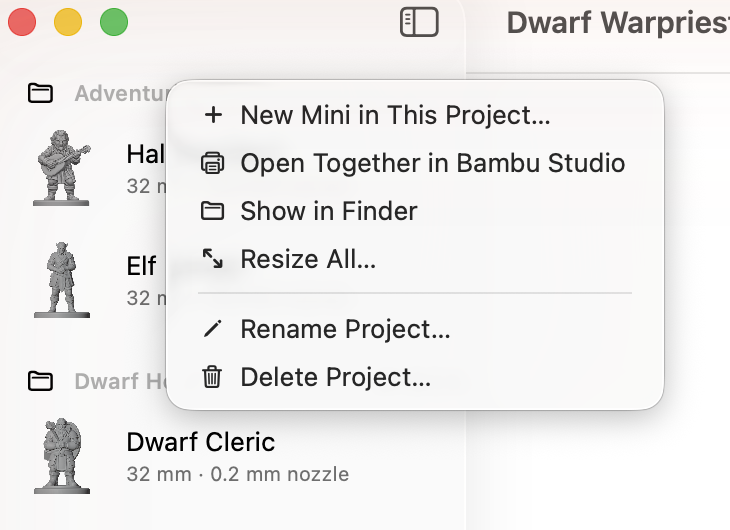

# Your minis and projects

Everything you make is in the list on the left of Mimic's window. This page covers finding a
mini, what its page shows, grouping minis into projects, and renaming, moving and deleting them.

## The list of minis

The list on the left is headed **Minis**. Each mini shows its picture, its name, and a line
under it:

| The line says | It means |
|---|---|
| *32 mm · 0.4 mm nozzle* | It's ready: its size and the nozzle it was made for |
| **Being made…** | It's being made now. A resize says **Resizing…** |
| **Waiting (2nd)** | It's waiting its turn in [the queue](queue.md) |
| **Picture ready to check** | Its picture was redrawn with a change, and waits for you (see [Versions](versions.md)) |
| **Not finished** | It stopped before it was done. Its page has **Try Again** |

Newest first, unless you choose otherwise. The button at the bottom right of the list sorts and
filters it:

- **Sort By**: **Date Made**, **Name** or **Size** (tallest first).
- **Show**: **All Minis**, **Characters**, **Objects** or **Unfinished Minis**. While a filter is
  on, the button is filled in, so you can tell some minis are hidden.

The same choices are in the **View** menu.

Once you have more than six minis, a search field appears at the top of the list (**Edit →
Find**, ++cmd+f++). It finds minis by name and by words in their descriptions, and ignores capitals
and accents: *elodie* finds "Élodie".

## A mini's page

Click a mini to open its page. The 3D view fills the middle: drag to turn it, scroll to zoom.
See [Printing and exporting](printing.md#the-3d-view) for everything it does.

The toolbar has:

- **More**: **Copies…**, **Resize This Mini…**, **Edit & Make Again…**, **Export for Virtual
  Tabletop…** and **Show in Finder**.
- **Open in …**: opens the mini in your slicer. The button names it, like **Open in Bambu
  Studio**. It stands out once the mini is finished, and is greyed out until then. See
  [Printing and exporting](printing.md).
- **Show Details** / **Hide Details** (++ctrl+cmd+i++): the details panel on the right.

The details panel has:

- **Size**: what the mini was made at (**Character** height, or **Longest side** for anything
  else; **Base**; **Nozzle**), and what its print file measures (**Height with base**,
  **Footprint**). **Filament** is roughly how much it takes, like "Up to 4 g · 1.3 m" of 1.75 mm
  PLA. That's for a solid print, so infill makes a big mini take less.
- **Previews**: the picture it was made from, and views from the front, left, right and back.
  Click one to open it in Quick Look. See [Printing and exporting](printing.md#previews-and-quick-look).
- **Versions**: its other versions, when it has some. See [Versions](versions.md).
- **Made from**: the picture or description, **Variation number**, **3D model**, **Grey
  sculpt**, whether it's a **Cartoon**, and when it was made. A mini made from a description has
  **Copy Description**, to use it again.
- **Print tips for a 0.4 mm nozzle** (or the mini's nozzle): the slicer settings to use, with
  **Copy Settings**. See [Printing and exporting](printing.md#print-tips-and-warnings).

If print prep left a part out, or the figure's bottom reaches past its base, a warning sits over the 3D
view until you resize the mini or make it again.

A mini that isn't ready has a different page:

- **Being made**: which step it's on and how long it has left, with **Show Progress**.
- **Waiting to be made**: its place in the queue and when it should be ready.
- **This mini didn't finish**: why, with **Try Again** and **Report a Problem…**.
- **Check the picture**: a picture redrawn with your change, with **Draw Again** and
  **Build Shape**. See [Versions](versions.md).

## Group minis into projects

A project is a folder of minis, for a party, a warband or a set of chess pieces. Each project is
a real folder in your minis folder, so Finder shows the same grouping. Projects don't go inside
other projects.

*Make a project:* press **New Project** at the bottom of the list, or choose **File → New
Project…** (++shift+cmd+n++). Name it and press **Create**.

*Put minis in it:*

- Drag minis onto the project's name, or onto any mini in it. An empty project says **Drag
  minis here**.
- Or right-click a mini → **Move to Project**, and pick the project. **New Project…** there
  makes one and moves the mini into it.
- To take a mini out of its project, drag it onto **Unsorted**, or choose **Move to Project →
  Unsorted**.

**New Mini** puts a new mini in the project of the mini you're looking at, and you can pick
another. Right-click a project → **New Mini in This Project…** starts one there.

Click the arrow beside a project's name to fold it away. Beside its name is roughly how much
filament all its minis need, like *≈ 23 g filament*.

Right-click a project's name for the rest:

| Choose | To |
|---|---|
| **New Mini in This Project…** | Make a mini that goes straight into it |
| **Open Together in …** | Open all its minis in your slicer at once, on one bed (see [Printing and exporting](printing.md#open-several-minis-together)) |
| **Show in Finder** | See the project's folder |
| **Resize All…** | Give every mini in it a new size at once (see [Sizes and bases](sizes-and-bases.md)) |
| **Rename Project…** | Give it a new name |
| **Delete Project…** | Remove the project |

**Delete Project…** asks what to do with its minis. **Keep Minis** moves them to Unsorted.
**Delete All** moves them to the Trash with the project. The project's folder always goes to the
Trash, never deleted for good, so you can put anything back from there.

!!! note
    A mini that's being made or waiting in the queue can't move to another project until it's
    made. A project can't be renamed while one of its minis is being made, or deleted while one is
    being made or waiting.

{ width="365" }

## Select several minis

Select several minis the Mac way: ++cmd++-click to add one, ++shift++-click for a run of them,
or ++cmd+a++ for every mini in view. The page then says how many are selected, with what you can
do to all of them.

Right-click any of them, or use the **Mini** menu, to:

- **Open Together in …** your slicer, on one bed
- print **Copies…** of each
- **Show in Finder**
- **Resize 3 Minis…** (or however many): one size for all of them
- **Move to Project**
- **Move to Trash**

You can also drag them onto a project together. A search or a filter unselects the minis it
hides, so nothing out of sight is moved or deleted with the rest.

## Rename a mini

Right-click it → **Rename…** (or **Mini → Rename…**), type the new name and press **Rename**.
**Edit → Undo** gives it back its old name. A mini that's waiting in the
queue or being made can be renamed once it's made.

Names can have capitals, accents, spaces and other alphabets: "Élodie", "D&D Bard", "Дракон".
Each name is used once across all your minis and projects, whatever the capitals.

## Move minis to the Trash

Right-click a mini → **Move to Trash**, or select it and press ++cmd+"Delete"++. Several selected
minis go together. Mimic doesn't ask first: **Edit → Undo** (++cmd+z++) puts them all back.

- A mini that's being made stays, and Mimic says so. Move it to the Trash once it's done.
- A mini waiting in the queue asks first. Undo can put it back from the Trash, but not back in
  the queue.

Minis always go to the Trash, never deleted for good, so you can also put them back from there
in Finder.

## Find a mini's files

Right-click a mini → **Show in Finder** (++opt+cmd+r++). Finder opens with its print file
selected, or its folder if it isn't made yet. Right-click a project's name → **Show in Finder**
for the project's folder.

Your minis are kept in **Documents → Mimic**. To keep them somewhere else, choose
**Settings → General → Change…** (see [Settings](settings.md)). What's in each mini's folder is in
[Where your files are](files.md).

## Changes made in Finder or Terminal

The list keeps up by itself. When a mini or project is added, removed or renamed in your minis
folder, by Finder, by `mimic` in Terminal or by another Mimic, the list changes too. It also
refreshes whenever you come back to Mimic.

You can rename or copy a mini's folder in Finder. Mimic takes it over under the new name, so it
can still be renamed, moved and moved to the Trash like any other. A print file you drop into a
mini's folder is left as it is: Mimic only takes over print files it made.

## A mini's two names

A mini has the name you gave it, which Mimic shows everywhere, and a folder name made from it in
plain letters. Its files and the queue go by the folder name.

| You type | Its folder |
|---|---|
| Élodie | elodie |
| Дракон | drakon |
| Straße | strasse |
| D&D Bard | d-d-bard |
| 🐉 | mini |

In Terminal you can use either: `mimic info "Élodie"` and `mimic info elodie` find the same
mini, and `mimic list` shows both. See [Mimic from a terminal](cli.md).

If you rename a mini's folder in Finder, the folder wins: Mimic shows the folder's new name.
