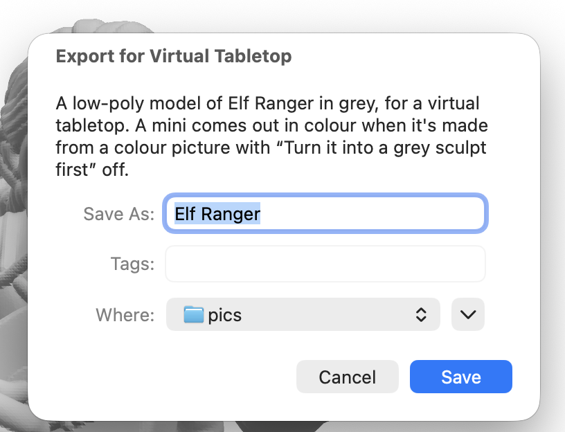

# Printing and exporting

Once a mini is made, this page gets it to your printer: opening it in your slicer, putting a
whole party on one bed, looking it over in 3D first, and exporting it for a virtual tabletop.

## Open a mini in your slicer

Press **Open in …** in the toolbar of the mini's page. The button names your slicer, like
**Open in Bambu Studio**. It's also in the mini's right-click menu, in the **Mini** menu
(++cmd+o++), in the progress in the toolbar when a mini is ready, and on its notification.

Mimic opens the mini's print file (an STL) in the slicer chosen in **Settings → General →
Open minis in**. It lists the slicers it finds on your Mac, including Bambu Studio, OrcaSlicer,
PrusaSlicer and UltiMaker Cura. Using another slicer? Choose **Mac's default app for 3D files**.

Then slice and print with the settings under [Print tips](#print-tips-and-warnings) on the mini's
page.

## Open several minis together

Select several minis (++cmd++-click them), or right-click a project, and choose
**Open Together in …**. Your slicer opens one print file with every mini laid out on the bed, a
little apart. Each is its own object, named after the mini, so you can move or remove any of them.

The file is named after the project, when the minis share one. Mimic keeps it in a temporary
folder, so save it from your slicer as a project if you want to keep it.

!!! tip
    **Copies…**, next to it, puts several of the same mini on the plate: up to 20 of each, side by
    side in one print file. Right-click a mini, or several, choose **Copies…**, set how many and
    press **Open in …**.

## Drag a mini out

Drag a mini from the list onto Finder, the Desktop, your slicer or a chat app, and you get its
print file there. On a mini's page you can drag any of its previews out the same way. The file
has the mini's name.

Several selected minis drag together only onto a project, to move them. Use
[Open Together](#open-several-minis-together) to get them into your slicer in one go.

## Previews and Quick Look

A mini's page has previews in the details panel: the picture it was made from, and views from
the front, left, right and back. Click one to open it in Quick Look, where you can go full screen
or share it.

- In Quick Look, ++left++ and ++right++ go through the previews, and ++space++ closes it.
- On the page, once you've clicked a preview, ++left++ and ++right++ go through them too,
  ++up++ and ++down++ move up and down the grid, and ++space++ or ++"Return"++ opens Quick Look.

In the list of minis, select a mini and press ++space++ to see its print file in Quick Look.
Press ++space++ again to close it.

## The 3D view

The middle of a mini's page is a 3D view of its print file. It's what you'll print, base included.

- *Turn it:* drag it. Or click it, then press ++left++ and ++right++ to turn it, and ++up++
  and ++down++ to tilt it.
- *Zoom:* scroll the mouse wheel, or pinch or scroll with two fingers on a trackpad. It zooms
  toward the spot under the pointer. Once you've clicked it, ++cmd+"="++ and ++cmd+"-"++ zoom too.
- *Back to the front:* double-click it, press the **Face Front** button at its top right, or
  choose **View → Face Front** (++cmd+0++). It turns the mini to face you and zooms back out.

At the top right, a badge gives its size with the base: its height, then the footprint it stands
on, like *34 mm tall · 26 × 25 mm*.

### See how big it really is

The ruler button beside the size badge is the **Size Reference**. It puts something of a known
size next to the mini, at the same scale:

| Choose | To see |
|---|---|
| **25 mm Base** | A ring the size of a standard 25 mm base |
| **32 mm Person** | A 32 mm figure standing beside it |
| **Millimetre Grid** | A grid on the floor. On a mini taller than 40 mm the squares grow to 2, 5 or 10 mm, and the badge says which |
| **None** | Just the mini |

Your choice stays for every mini. It's also in **View → Size Reference**.

## Export for a virtual tabletop

Playing online? Right-click a mini → **Export for Virtual Tabletop…**, choose where to save it,
and Mimic shows it in Finder. It's a small, low-poly `.glb` (about 5,000 triangles) at the mini's
real size, to drag into a virtual tabletop.

It comes out in colour or in grey:

- *In colour* (about 1.6 MB) when the mini was made from a colour picture with
  **Turn it into a grey sculpt first** off. The 3D engine then paints it from your picture, back
  and sides too, and each part of the exported model takes the colour of the same place on the
  3D engine's model. The base Mimic adds stays grey.
- *In grey* (under 100 KB) otherwise: a mini made from a description, with the grey sculpt on, a
  cartoon (which gets the grey sculpt), one imported as a 3D model, or a version made [with a change to its picture](versions.md).

The save window says which you'll get before you save. If a mini that should be in colour can't
be, for example because its 3D model is missing from its folder, Mimic exports it in grey anyway
and tells you why.

!!! tip
    The grey sculpt usually gives the cleaner shape to print. Turn it off only for the minis you
    want in colour on the virtual tabletop. See [Better minis from pictures](pictures.md).

In Terminal: `mimic export <name> --vtt`. See [Mimic from a terminal](cli.md).

{ width="408" }

## Print tips and warnings

Each mini's page has **Print tips** for the nozzle it was made for, in the details panel. Press
**Copy Settings** to keep them in your slicer's notes.

| Nozzle | Layer height | Walls | What to expect |
|---|---|---|---|
| 0.2 mm | 0.06–0.08 mm | 3–4 | The most detail, like sharp faces and belt buckles. Slow |
| 0.4 mm | 0.12 mm | 3 | Faces and weapons come out clearly; hair strands and cloth edges get softened |
| 0.6 mm | 0.2 mm | 2–3 | Quick and sturdy; small details blur. Best at 54 mm scale or bigger |

For all of them, use tree supports (auto). Stand a character upright on its base, with no brim.
Print anything else as it sits, since its bottom is already flat, and add a brim if it's tall
and narrow. To choose a nozzle and size, see [Sizes and bases](sizes-and-bases.md).

Sometimes Mimic needs to tell you something about a mini. It says so over the 3D view, beside an
orange warning sign, and it stays there after you quit, until you resize the mini or make it again:

- *A part was left out.* Something the character holds, like a bow or a staff, sometimes
  comes out of the 3D model separate from the hands. Mimic leaves it out of the print file,
  since it would print floating in mid-air, and says how long it was. Try
  [Make Another Version…](versions.md). If you use Pixal3D, TRELLIS.2
  (**Settings → 3D Model**) joins held things more reliably.
- *The bottom of the figure reaches past the edge of its base.* Resize it with a bigger base
  size, in **Resize This Mini…**, to fit it on.
- *It can't stand on its own.* An object made without a base that would tip over is left
  upright, as the 3D engine made it. Turn on **Add a base** in Resize to stand it up.

For how print prep thickens thin parts and makes the print file, see
[Tuning print prep](print-prep.md).
