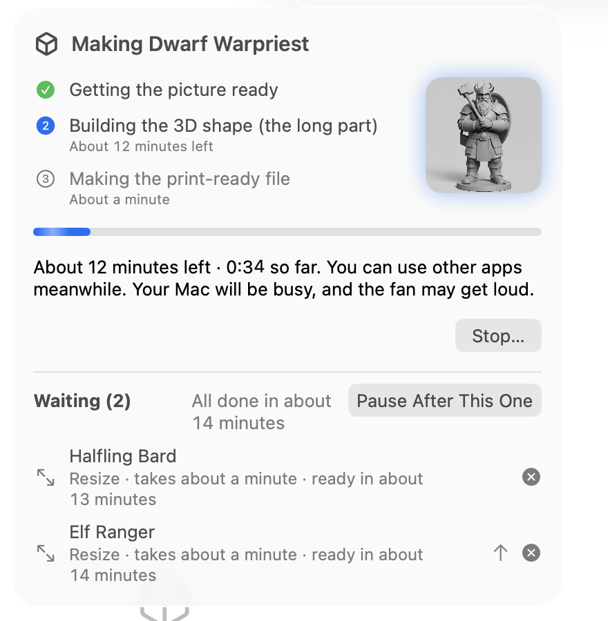

# The queue

Mimic makes one mini at a time. Ask for more while one is being made and they wait their turn
in the queue, so you can line up a whole party and walk away. This page covers following the
queue, changing its order, pausing it, and stopping a mini.

## Line up several minis

Press **Make Mini** while another mini is being made, and the new one joins the queue. Mimic
tells you its place and when it should be ready, like "Added to the queue. 1 ahead of it. Ready
in about 20 minutes." Resize, Try Again, Make Another Version and the rest wait their turn the
same way.

Some ways to add several at once:

- Drop several pictures on New Mini: each becomes a mini, made with the same settings.
- Right-click a project → **Resize All…**, or select several minis and choose **Resize 3 Minis…**
  (or however many).

Keep using Mimic meanwhile. Each mini's notification tells you when it's ready, and the Dock icon
counts the minis that are ready and you haven't looked at yet.

## Follow the queue

The mini being made shows in the toolbar, with a ring that fills up, its name and the time so
far. Click it to see:

- the three steps: **Getting the picture ready**, **Building the 3D shape (the long part)** and
  **Making the print-ready file**, each with its time left
- **Stop…**, for the mini being made
- **Waiting**, with each mini in the queue, how long it takes and when it should be ready, and
  when the whole queue should be **All done**
- **Finished while you waited**, with how each one went, and **Try Again** for one that didn't
  finish

The list of minis shows a waiting mini as **Waiting (2nd)** and the one being made as
**Being made…**. **Mini → Show Progress** opens the same popover from the keyboard.

!!! tip
    Want to keep an eye on it? Drag the popover away from the toolbar and it stays open in a small
    window of its own.

{ width="440" }

The times come from the minis your Mac has made before. Until it's made a few, Mimic uses its
own figures.

## Change the order

Only waiting minis move. The one being made always carries on.

- Drag a waiting mini onto another's place in the list of waiting minis.
- Press the up arrow beside it to move it one place sooner.
- Right-click it for **Move to Front**, **Move Up**, **Move Down** and **Move to End**.

The same choices are in **Mini → Move in Queue** for the selected mini, with ++opt+cmd+up++ and
++opt+cmd+down++, and in a waiting mini's right-click menu in the list of minis.

## Take a mini out of the queue

Press the remove button beside it, or right-click it → **Take Out of Queue…**, and confirm with
**Take Out**. Mimic says what happens to it:

- A new mini: "It hasn't been made yet, so its picture and settings go to the Trash, where you can
  get them back."
- A model you're importing: "It hasn't been made yet, so it goes to the Trash, where you can get it
  back."
- A resize is cancelled with **Don't Resize**: "It keeps its current size."
- A mini waiting for Try Again: "It stays, so you can try again later."

## Pause the queue

Choose **Pause After This One**. The mini being made finishes, and no new one starts until you
choose **Resume Queue**. With nothing being made, the choice is **Pause Queue**. They're in the
progress popover, in the **Mini** menu, and in the Dock icon's menu.

Once the mini being made is done, the toolbar says **Paused · 2 waiting** (or however many). The
pause holds for every Mimic on your Mac and for Terminal. In Terminal, `mimic queue pause` pauses
it too, and `mimic queue resume` lifts the pause for Mimic to carry on.

## Wait for power on a laptop

On a Mac with a battery, turn on **Settings → General → Start minis only when plugged in**. While
your Mac runs on its battery, the next mini waits, and the toolbar says
**On battery · 2 waiting**. When you plug in, the queue carries on by itself. A mini already being
made carries on either way.

## Stop a mini

Click the progress in the toolbar and press **Stop…**, or choose **Mini → Stop Making…**
(**Stop Resizing…** for a resize). It's also in the Dock icon's menu. Mimic asks first, and says
what happens to the mini:

- A new mini, or a model you're importing: "What's been made so far will be thrown away." Its
  pieces are in the Trash if you want them.
- A resize: "It keeps its previous size."
- A Try Again: "It's kept, so you can try again later." The mini goes back to how it was before.

The queue carries on with the next mini. Only the mini being made stops.

If the progress says another Mimic is making it (another copy of the app, or Terminal), stop it
there, or with `mimic stop`.

## Closing the window and quitting

Closing Mimic's window doesn't stop anything. The mini carries on, with a progress bar on the
Dock icon. Click the Dock icon to bring the window back.

Quitting while a mini is being made asks first. If you quit, the mini goes back to the front of
the queue, and the next time you open Mimic it carries on from the last step it finished. The
minis waiting after it follow, without asking. Logging out, restarting or shutting down your Mac
doesn't wait for an answer, and loses only the step in progress.

## Your Mac stays awake

While Mimic is making minis, your Mac doesn't go to sleep on its own, from the first mini to the
last in the queue. The screen can still turn off, and closing the lid still puts it to sleep.
While the queue is paused or waiting for power, your Mac can sleep as usual.

Minis are made at a lower priority, so your Mac stays quick to use meanwhile.

## The queue in Terminal

The app and `mimic` in Terminal share one queue. A mini added in Terminal shows in the app's
queue, and the other way round.

- `mimic make` while a mini is being made adds to the queue, tells you its place, and returns.
  With `--wait`, it stays until its mini is made.
- If `mimic make` starts the queue itself, it carries on only until its own mini is made. The
  rest wait until Mimic is open.
- `mimic queue` lists the queue. `mimic queue move`, `remove`, `pause` and `resume`, and
  `mimic stop`, do what the app does.

See [Mimic from a terminal](cli.md), and [JSON for scripts](cli.md#json-for-scripts) for
`mimic queue --json`.

!!! note
    An update to Mimic waits until the queue is done, so it never interrupts a mini.
