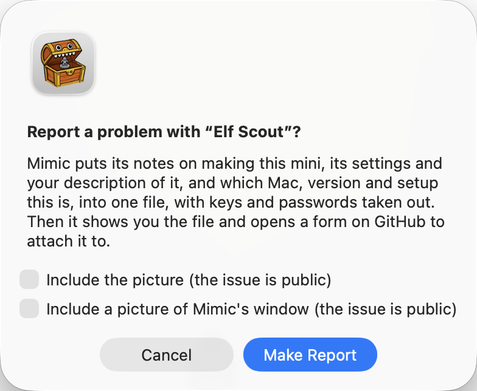

# Report a problem or an idea

Found a bug, or a mini that came out wrong? Have an idea for something Mimic should do? Tell us on
GitHub. Mimic is a hobby project, so every report and idea makes a real difference, and you don't
need to know anything about code.

You need a free [GitHub account](https://github.com/signup) to post. Issues are public, so don't
put anything private in them.

## Report a problem from Mimic

The easiest way to report a bug. Mimic gathers what's needed to fix it into one file and open a bug report
on GitHub for you to attach it to.

- For a mini that didn't finish: press **Report a Problem…** on its page, or choose it from the
  **Mini** menu or by right-clicking the mini.
- For anything else: choose **Help → Report a Problem…**.

{ width="384" }

Mimic first says what goes in the file. Press **Make Report**. The file has:

- which version of Mimic this is, and which Mac (model, chip, memory and macOS version)
- Mimic's own notes on what happened, from the last hour, and only since Mimic was last opened
- how Mimic is set up: the 3D model and the engine's version, Draw Things' model and whether its
  command line tool or the app draws (or which service makes the pictures online), which AI helper (never its key or address), free disk space,
  memory pressure, whether your Mac is on battery, its graphics chip, what's being made and waiting
  and how the last job ended (by kind and step, never by name), the nozzle, base and grey sculpt,
  and a few of its settings
- for a mini, its notes on how it was made and its settings

Keys, passwords and your Mac's user name are taken out first. Two boxes say which pictures go in,
since the issue is public:

- **Include the picture (the issue is public)**, when reporting a mini that has one: the picture
  it was built from. It starts unticked.
- **Include a picture of Mimic's window (the issue is public)**, when the main window is open: the
  window as it was when you chose Report a Problem, with any sheet open on it, but not Settings.
  It starts unticked, since the window can show your other minis' names and pictures. The preview
  underneath shows what it would include; tick it to put it in.

The 3D files and previews themselves are never included.

Mimic then shows the file in Finder and opens GitHub's bug report form with the version, your Mac
and a short list of the setup filled in. Drag the file into the form's logs box, say what you did,
and send it. You need a GitHub account to send it. Nothing is sent until you do.

## After Mimic quits unexpectedly

If Mimic (or `mimic` in Terminal) crashed, the next time you open Mimic it asks
"Mimic quit unexpectedly last time. Report it?"

- **Report** makes the same kind of file, with what macOS noted about the crash, Mimic's own notes
  from before it, and the setup as it is now. There's no picture of the window, since Mimic had
  already gone. Mimic shows the file in Finder and opens GitHub's form, titled with the crash, for
  you to say what you were doing.
- **Not Now** makes no report.
- **Don't Ask Again** stops Mimic asking about crashes at all.

Each crash is asked about once, whatever you answer. Mimic's notes from before the crash can only be
read on an administrator account; on another, or if your Mac takes over a minute to find them, the
file says so. A crash of the 3D engine or of
Draw Things' command line tool isn't asked about: it shows as a mini that didn't finish, with
**Report a Problem…** on its page.

!!! tip
    The reports stay in your minis folder, in a folder called `_reports`, which Mimic doesn't show
    as a project. Mimic deletes them a week after they're made, when it makes the next one, so send
    a report within a week, or keep a copy somewhere else. You can delete them yourself once
    they're sent.

## Report a problem yourself

If Mimic won't open, or you'd rather write it up yourself,
[open an issue](https://github.com/yonatankarp/mimic/issues/new/choose) and pick **Something went
wrong**. The form asks for what helps most:

- **What happened?** What you did, what you expected, and what happened instead.
- **Mimic version**: at the bottom of **Settings → Advanced**, or **Mimic → About Mimic**.
- **Your Mac and macOS version**: Apple menu → About This Mac.
- **Logs and pictures**: for a mini that failed or came out wrong, its picture and its log files.
  Right-click the mini → **Show in Finder**; the logs are `generate.job.log`, `pixal3d.log` and
  `prep.log` in its folder. If a check in **Settings** is red, a screenshot of it helps too.

## Suggest an idea

[Open an issue](https://github.com/yonatankarp/mimic/issues/new/choose) and pick **An idea**. Say
what you'd like to do that Mimic doesn't let you do yet: the problem matters more than a particular
solution, so describe what you're trying to make or print.
