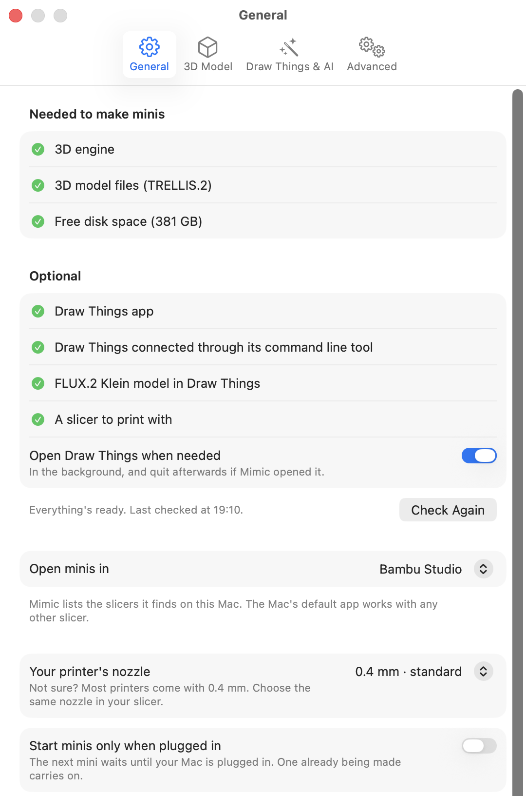
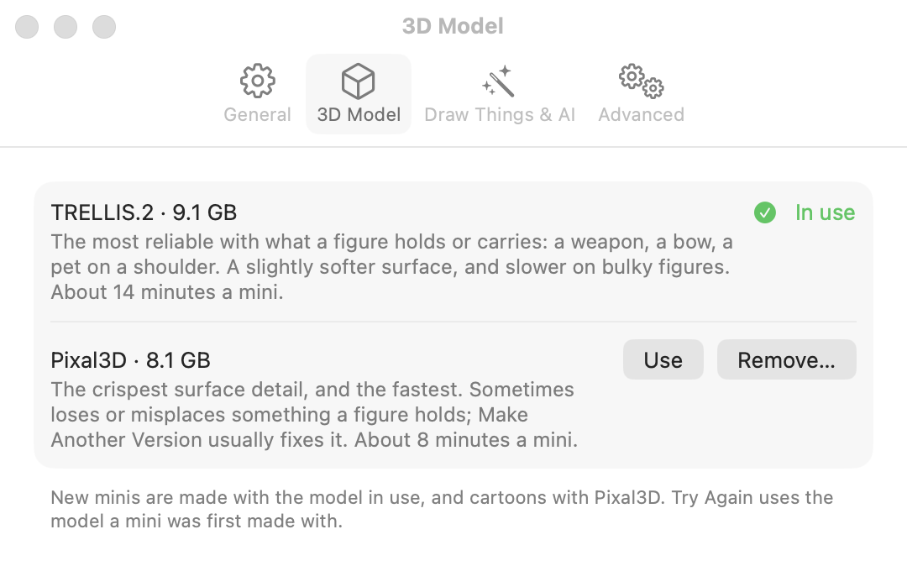
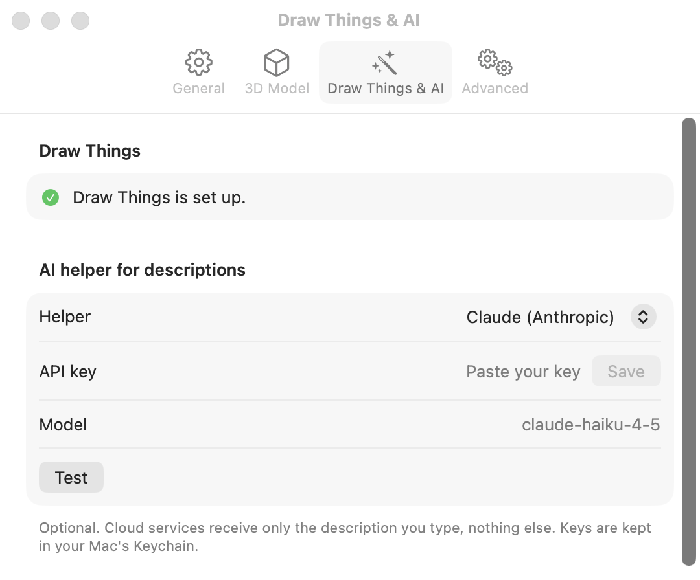
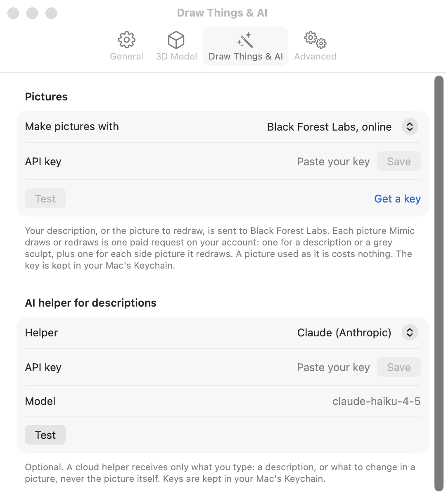
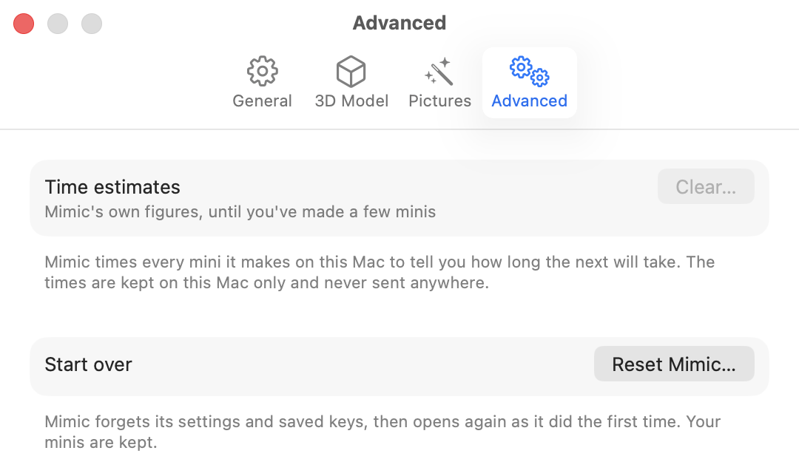

# Settings

Settings is where you check that Mimic has everything it needs, pick the 3D model it makes minis
with, choose what makes pictures and set up the AI helper, and choose where your minis are kept. Open it from
**Mimic → Settings…** (++cmd+comma++). It has four tabs: **General**, **3D Model**,
**Draw Things & AI** and **Advanced**.

!!! tip
    You rarely need to go looking. If something stops Mimic making minis, **Needs Setup** appears
    in the toolbar, and clicking it opens Settings on the right tab.

## General

{ width="540" }

### Check that everything is set up

The top of the tab lists what Mimic depends on, and checks each one every time you open Settings.
A green tick means it's ready. A red cross means Mimic can't make minis until it's fixed; an orange
triangle means only one feature is off. Under anything that isn't ready, Mimic says how to fix it.
Hold the pointer over a name to see what that part is for.

**Needed to make minis**

| Check | What it is | If it isn't ready |
|---|---|---|
| **3D engine** | Turns your picture into a 3D shape, on your Mac's graphics chip. | Press **Repair**: Mimic downloads it again. |
| **3D model files** | What the 3D engine has learned, for the 3D model in use. Downloaded once. | Press **Download**: Mimic fetches only what's missing. |
| **Free disk space** | Shows how much space is free. Each mini needs about 150 MB while it's being made. | Free up some space. The check passes with 5 GB free. |

**Optional**

| Check | What it is | If it isn't ready |
|---|---|---|
| **Draw Things app** | A free app that draws characters from a description and turns pictures into grey sculpts. | Install Draw Things from the Mac App Store. |
| **Draw Things is open and connected** | Lets Mimic ask Draw Things for pictures. It usually reads **Draw Things connected through its command line tool**, which means nothing more is needed. | See [Draw Things & AI](#draw-things-ai). |
| **FLUX.2 Klein model in Draw Things** | The picture model Mimic asks Draw Things to use. | In Draw Things' model list, search for FLUX.2 Klein and download it. |
| **Black Forest Labs key works** or **OpenAI key works** | Shows instead of the three Draw Things checks when [pictures are made online](#choose-what-makes-the-pictures), named after the service you chose. Mimic asks the service whether the key works, which costs nothing. | Save your key on the [Draw Things & AI](#draw-things-ai) tab, or copy it again from your account. |
| **A slicer to print with** | Turns a mini into instructions for your printer. | Install a slicer such as Bambu Studio, OrcaSlicer, PrusaSlicer or Cura. Mimic links to OrcaSlicer, a free one. |

Without the optional parts you can still make minis from your own pictures. Draw Things (or an
online service) adds making a mini from a description, the grey sculpt and **What to change**.

At the bottom of the list Mimic says how it went ("Everything's ready." or how many things to look
at) and when it last checked. **Check Again** runs the checks now. While a mini is being made the
checks wait, because they start the 3D engine the mini is using, and run when it's done.

### Open Draw Things when needed

On unless you turn it off. When a mini needs a picture drawn and Draw Things isn't running, Mimic
opens it in the background, and quits it afterwards if Mimic was the one that opened it.

Most of the time this doesn't come into play: Mimic draws pictures through Draw Things' command
line tool, which it downloads with its 3D engine, so Draw Things doesn't need to be open at all.
The setting matters only when that tool is missing. It isn't shown while pictures are made online.

If a Draw Things check fails, **Draw Things isn't set up yet** appears here with a
**Set Up Draw Things…** button, which takes you to the steps on the
[Draw Things & AI](#draw-things-ai) tab. With pictures made online, a key that doesn't work shows
**Online pictures aren't set up yet** and **Set Up Pictures…** instead.

### Choose the slicer minis open in

**Open minis in** decides where **Open in …** sends a finished mini. Mimic lists the slicers it
finds in your Applications folder, such as Bambu Studio, OrcaSlicer, PrusaSlicer, UltiMaker Cura,
Creality Print, ElegooSlicer, Anycubic Slicer Next, SuperSlicer, ideaMaker, FlashPrint, Simplify3D,
Lychee Slicer and CHITUBOX. Until you choose, it uses the first one it finds.

Choose **Mac's default app for 3D files** to use any other slicer: Mimic then opens minis with
whichever app your Mac opens 3D files with.

### Choose your printer's nozzle

**Your printer's nozzle** is the tip your printer prints through: **0.2 mm · fine**,
**0.4 mm · standard** or **0.6 mm · fast**. Not sure? Most printers come with 0.4 mm. Every new mini
is sized for it, and New Mini shows it under **Size & printer**. Choose the same nozzle in your
slicer. See [Sizes and bases](sizes-and-bases.md#choose-your-nozzle).

### Wait for the charger on a MacBook

**Start minis only when plugged in** is off unless you turn it on, and only shows on a Mac with a
battery. When it's on and your Mac is running on its battery, the next mini waits in the queue.
One already being made carries on. Plug in and the queue starts again by itself. It holds minis
made in Terminal too.

### Choose where your minis are kept

**Your minis are saved in** shows the folder, which is **Documents → Mimic** unless you've changed
it. **Open Minis Folder** shows it in Finder.

To keep your minis somewhere else, press **Change…**, pick a folder and press **Use This Folder**.
Mimic then asks whether to move your minis there:

- **Move Minis** moves every mini and project to the new folder.
- **Don't Move** leaves them where they are. Mimic then shows only the minis in the new folder.
  Pick this when the folder already has minis of its own, say from another Mac: Mimic shows those.

You can change the folder once no mini is being made or waiting in the queue. Mimic won't use a
folder inside the one your minis are in now, or one that holds it, and it won't move minis onto
others with the same names: it names them, so you can rename yours first. If a move goes wrong,
your minis stay where they were. While they're moving, making, resizing, renaming, moving or
trashing a mini, and making a project, wait: Mimic asks you to try again once the move is done.
For more on the folder itself, see [Where your files are](files.md).

### Updates

**Check for updates when Mimic opens** is on unless you turn it off. Mimic then asks GitHub for
its latest release each time you open it. Only public release information is read: nothing about
your Mac or your minis is sent. **Last checked** says when it last asked, and **Check Now** asks
straight away. While a check is under way, such as the one when Mimic opens, **Check Now** and
**Check for Updates…** are dimmed. You can also choose **Mimic → Check for Updates…** at any
time. With the switch off, Mimic only checks when you ask.

When there's a new version, a few seconds after Mimic opens, a window shows it, with what's new.
If you've switched to another app by then, the window waits until you come back to Mimic.
**Install Update** updates Mimic, **Skip This Version** stops Mimic showing that version when it
opens (**Check Now** and **Check for Updates…** still show it), and **Remind Me Later** asks again
the next time you open Mimic. Until then a note stays in the toolbar ("Mimic 0.12.0 is
available", say): click it to see the window again. Mimic never installs an update while a mini
is being made or waiting: the note then says the new version installs when the queue is done,
and it does. If Mimic is asking you something then, the update waits until you've answered.

## 3D Model

{ width="540" }

Mimic can make minis with two 3D models. Each row shows its name, its size, what it's good at and
how long a mini takes. Once you've made a few minis, the time is the one measured on your Mac.

| Model | Size | A mini takes about | Good at |
|---|---|---|---|
| **TRELLIS.2** (the default) | 9.1 GB | 14 minutes | The most reliable with what a figure holds or carries: a weapon, a bow, a pet on a shoulder. A slightly softer surface, and slower on bulky figures. |
| **Pixal3D** | 8.1 GB | 8 minutes | The crispest surface detail, and the fastest. Sometimes loses or misplaces something a figure holds; **Make Another Version** usually fixes it. |

- **In use** marks the model new minis are made with.
- **Use** switches to a model that's already downloaded.
- **Download** fetches a model you don't have yet. Once it's done, Mimic uses it. A download that
  stopped shows **Resume Download**, which carries on where it left off. You can keep making
  minis meanwhile.
- **Remove…** deletes a model you aren't using and says how much space that frees. Minis you made
  with it stay, and you can download it again any time. You can't remove a model while a mini
  is being made.

!!! note
    Some things always use a particular model, whichever is in use:

    - A cartoon (**It's a cartoon** in New Mini) is always made with Pixal3D, so that needs
      Pixal3D downloaded.
    - **Try Again** uses the model the mini was first made with, so that model has to be
      downloaded.
    - Pictures of the back and sides only work with TRELLIS.2.

    The two models share some files, so having both takes less space than their sizes added up.

For how the models compare in more detail, see [How it works](how-it-works.md#the-3d-models).

## Draw Things & AI

{ width="540" }

### Choose what makes the pictures

Mimic draws a character from a description, and redraws your picture as a grey sculpt, with a
picture model. Under **Pictures**, **Make pictures with** chooses where that model runs:

- **Draw Things, on this Mac** (the default). Free, and nothing leaves your Mac. It needs the
  Draw Things app and its model, set up as below.
- **Black Forest Labs, online.** The same kind of model (FLUX.2 Klein), run by the company that
  makes it, with your own account.
- **OpenAI, online.** OpenAI's picture model, with your own OpenAI account. It's a different
  model from the other two, so its pictures look a little different. Each picture is drawn afresh,
  so **Try Again** with the same variation number doesn't give the same picture.

With either online service, Draw Things isn't needed. Paste your API key from that service and
press **Save**: Mimic keeps it in your Mac's Keychain and shows **API key saved in your Keychain**,
with **Remove** to delete it. Each service has its own key, so switching between them keeps both.
**Get a key** opens the service's website, where you make one. **Test** asks the service whether
the key works and says **It works.**, or what went wrong. While an online service is chosen, this
tab doesn't show the Draw Things steps below, and the General tab doesn't show **Open Draw Things
when needed**.

{ width="540" }

!!! note "What the online service sees, and what it costs"
    With **Black Forest Labs, online** or **OpenAI, online**, your description, or the picture to
    be redrawn, is sent to that service to make the picture, and to no one else. The 3D model and print file are still made on your Mac.
    Each picture Mimic draws or redraws is one paid request on your account with that service: one for a mini made from a description or with the grey sculpt, plus one for each extra
    side picture it redraws. A picture used as it is costs nothing. A new version with a new
    picture costs the same again; a picture that's already made is never asked for twice.

If the service is busy, Mimic waits and asks again, twice at most; a request the service turns
away isn't charged. If the service turns a picture down (its moderation does that now and then),
is still busy, or takes too long, the mini stops with a message saying so, and nothing else about
it changes. Press
**Try Again**, or change the description. If your account is out of credits or has reached its
spending limit, the message says so: add credits or raise your limit on the service's website
first.

### Set up Draw Things

Draw Things is a free app that lets Mimic draw a character from a description, and turn your
picture into a grey sculpt (which gives better minis). While it isn't set up, this tab shows three
steps that tick themselves off as you do them:

1. **Get Draw Things from the App Store.** It's free. **Open the App Store** takes you there.
2. **Connect Mimic to it.** Mimic does this itself, with Draw Things' command line tool, which comes
   with the 3D engine. Draw Things doesn't even need to be open.
   If that tool is missing, turn on Draw Things' API server instead: in Draw Things, open
   **Settings → Advanced → API Server**, turn it on, choose HTTP and set the port to 7860.
3. **Download FLUX.2 Klein.** In Draw Things' model list, search for FLUX.2 Klein and download it.
   It's big, so give it a few minutes.

Once everything is ready, the tab says **Draw Things is set up.**

### Choose an AI helper for descriptions

The **AI helper for descriptions** is optional and **Off** unless you choose one. With a helper
chosen, New Mini gets an **Improve Description** button that writes a fuller description from a
few words, which you can edit or swap back with **Use Original**. The helper also rewrites what you
type in **What to change** into clear instructions for the redraw.

Pick one under **Helper**:

| Helper | What you fill in |
|---|---|
| **Claude (Anthropic)** | Your API key. **Model** can stay blank, which uses Claude Haiku 4.5: quick and inexpensive. |
| **OpenAI-compatible service** | Your API key, the service's address in **Service address** (blank means OpenAI) and the model's name in **Model**, as the service writes it. |
| **Ollama, on this Mac** | Pick a model from the ones installed. **Refresh** looks again. If none are installed, Mimic says how to get one (`ollama pull gemma3` in Terminal). If a bigger model that follows instructions better is installed, Mimic suggests it with **Use It**. |

For a cloud service, paste your key under **API key** and press **Save**. Mimic keeps it in your
Mac's Keychain and shows **API key saved in your Keychain**, with **Remove** to delete it. A key is
only ever sent to the address it was saved for: change the address and you'll need to save a key
for the new one. The address has to start with `https://`, unless the service runs on your own Mac
(`localhost` or `127.0.0.1`), where `http://` works too.

**Test** sends a tiny request and says **It works.**, or what went wrong.

!!! note "What the helper sees"
    A cloud service receives only what you type: a description, or what to change in a picture,
    never the picture itself, and no minis. Ollama runs on your Mac, so with it what you type stays
    there.

## Advanced

{ width="540" }

### Time estimates

Mimic times every mini it makes to tell you how long the next will take. **Time estimates** says
whether it's using its own figures (until you've made a few minis) or how many of your minis it's
learned from. Pictures drawn by Draw Things and by each online service are timed apart, so
switching between them doesn't throw the estimate off. The times are kept on your Mac only and never sent anywhere.

**Clear…** makes Mimic forget them and go back to its own figures. Your minis are kept.

### Reset Mimic

**Reset Mimic…** puts Mimic back the way it was the first time you opened it, and opens it again.
It asks first:

- **Reset** forgets Mimic's settings, its tips and any saved AI keys (the keys for online
  pictures too), and shows the tour again.
- **Reset All** does the same and also removes the 3D engine, so first-launch setup shows again and
  downloads it again (8.3 to 9.3 GB, depending on the 3D model).

Your minis are always kept, and so is the folder you chose for them. Everything else on these tabs
goes back to how it started, except that **Reset** keeps the 3D model you use. After **Reset All**,
setup starts on TRELLIS.2, and you can choose Pixal3D there instead. You can't reset while a mini is
being made.

### Which Mimic this is

At the bottom of the tab is the exact version and build of Mimic, like
"Mimic 0.10.0 · build 412 · 1a2b3c4". You can select and copy it. Include it when you report a
problem (Help → **Report a Problem…** adds it for you).

## Not in Settings

- **Mimic → Install Command-Line Tool…** adds the `mimic` command to Terminal. See
  [Mimic from a terminal](cli.md).
- Sizes, base and the rest are chosen per mini, in New Mini and Resize. New Mini remembers
  what you size for, the base shape and magnet from last time (a reset forgets them too, and your
  nozzle). See
  [Sizes and bases](sizes-and-bases.md).

## Defaults at a glance

| Setting | Tab | Starts as |
|---|---|---|
| Open Draw Things when needed | General | On |
| Make pictures with | Draw Things & AI | Draw Things, on this Mac |
| Open minis in | General | The first slicer Mimic finds, else the Mac's default app for 3D files |
| Your printer's nozzle | General | 0.4 mm · standard |
| Start minis only when plugged in | General | Off (MacBooks only) |
| Your minis are saved in | General | Documents → Mimic |
| Check for updates when Mimic opens | General | On |
| 3D model in use | 3D Model | TRELLIS.2 |
| AI helper for descriptions | Draw Things & AI | Off |
