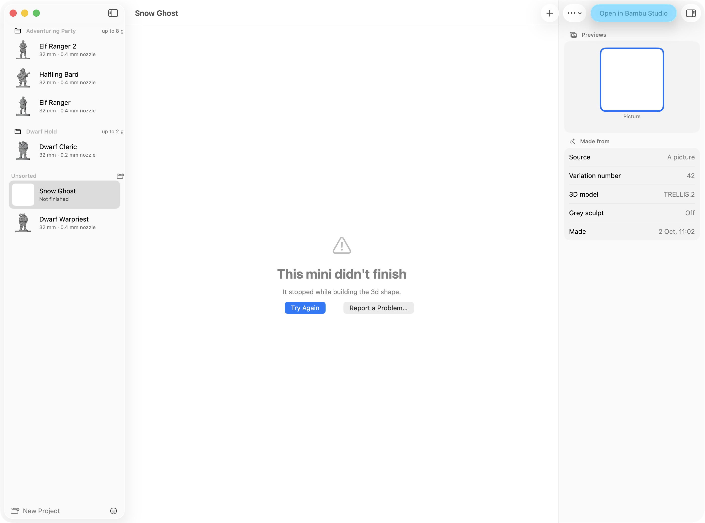

# When something goes wrong

What to do when a mini doesn't finish, when Mimic says it needs setting up, or when something else
isn't right, and how to send a report so it can be fixed.

## A mini didn't finish

When a mini stops part way, Mimic tells you, and you lose nothing: its page says
**This mini didn't finish**, with the reason underneath. The same happens in the progress popover
in the toolbar, and in a notification when you aren't looking at Mimic.

{ width="700" }

Press **Try Again** on its page, in the popover or on the notification. You'll also find it in the
**Mini** menu and when you right-click the mini. Try Again carries on from the step that failed,
with the same picture and settings: if the picture was already made, it isn't drawn again, and if
the 3D shape was already built, only the print-ready file is made again. It joins the queue like
any other mini.

A few things to know:

- **Try Again uses the 3D model the mini was first made with.** If you've removed that model,
  Mimic says so: download it again in [Settings → 3D Model](settings.md#3d-model), or make a new
  version instead.
- **When Draw Things was the problem**, the popover also shows **Open Setup**, which opens
  [Settings → Draw Things & AI](settings.md#draw-things-ai) on the steps to fix it.
- **A model you imported** has no picture to make again, so it shows **Resize This Mini…** instead,
  which makes its print-ready file again.
- **Stopping isn't failing.** A new mini you stop goes to the Trash. A resize you stop keeps the
  size it had. Stopping a Try Again puts the mini back how it was, ready to try again.
- **If it fails the same way again**, try **Make Another Version…**: the same picture and settings
  with a different variation number often gets past a problem one number runs into. If it still
  fails, [report it](#report-a-problem).

## Needs Setup

If something Mimic needs is missing, **Needs Setup** appears in the toolbar, and New Mini says
"Mimic isn't fully set up yet" with an **Open Settings** button. Hold the pointer over Needs Setup
to see what's missing, and click it to open Settings, which lists every check and how to fix it.

{ width="300" }

| Check | What it means | How to fix it |
|---|---|---|
| **3D engine** | The part that turns a picture into 3D is missing, won't start, or is an older version. | Press **Repair** next to it. Mimic downloads it again. |
| **3D model files** | Some files of the 3D model in use are missing or cut short. | Press **Download** next to it. Mimic fetches only what's missing. |
| **Free disk space** | Less than 5 GB is free on the disk your minis are on. | Free up some space: each mini takes about 150 MB while it's being made. |
| **Draw Things app** | Draw Things isn't installed. Optional: your own pictures still work. | Install Draw Things from the Mac App Store. It's free. |
| **Draw Things is open and connected** | Mimic can't reach Draw Things. Optional. | See [Draw Things isn't found](#draw-things-isnt-found) below. |
| **FLUX.2 Klein model in Draw Things** | Draw Things doesn't have the picture model Mimic uses. Optional. | In Draw Things' model list, search for FLUX.2 Klein and download it. |
| **A slicer to print with** | Mimic didn't find a slicer. Optional. | Install a slicer such as Bambu Studio, OrcaSlicer, PrusaSlicer or Cura. Until then Mimic opens minis with your Mac's default app for 3D files. |

Only the first three stop you making minis. The others switch off a feature: the Draw Things ones
switch off making a mini from a description, the grey sculpt and **What to change**.

Settings checks again every time you open it, and **Check Again** checks now. While a mini is being
made the checks wait until it's done.

## Common problems

### Your Mac says it can't check Mimic

Mimic is a free app that isn't registered with Apple, so the first time you open it your Mac may
say it can't check it. You only have to let it through once:

1. Press **Done** on that message.
2. Open **System Settings → Privacy & Security**.
3. Scroll down to "Mimic was blocked" and press **Open Anyway**.
4. Confirm with your Mac password or Touch ID.

### The first download stopped

Mimic needs to download its 3D engine once (8.3 to 9.3 GB, depending on the 3D model). If the
download stops, the welcome screen says why. Fix that, then press **Try Again**: Mimic carries on
where it stopped and keeps what's already downloaded. If you lost your connection, check it and
press Try Again. If the server had a problem, wait a few minutes first. A file that came down
damaged is downloaded once more.

If Mimic says the 3D engine doesn't start on this Mac, your Mac doesn't have an Apple chip. Mimic
needs an M1 or newer.

### Not enough space

Mimic checks there's room before it downloads anything, and tells you how much it needs. After
that, each mini takes about 150 MB while it's being made, and the **Free disk space** check wants
at least 5 GB free.

To make room, you can remove a 3D model you don't use in
[Settings → 3D Model](settings.md#3d-model) (**Remove…**). Mimic says how much space that frees
before it removes anything, and the minis you made with it stay.

### Not enough memory

Mimic is made for Macs with 32 GB of memory. On a Mac with less, the welcome screen warns you that
making a mini may be very slow or fail. If minis fail on such a Mac:

- Quit other apps while a mini is being made.
- Try Pixal3D in [Settings → 3D Model](settings.md#3d-model). It needs less memory than TRELLIS.2,
  and it's faster.

### Draw Things isn't found

Mimic only needs Draw Things to draw a character from a description, make a grey sculpt or change
a picture. Your own pictures work without it. If it's set up and Mimic still can't use it:

- **Is it in your Applications folder?** Mimic looks for Draw Things in Applications (yours or the
  Mac's). Installed from the App Store, it's there.
- **Is FLUX.2 Klein downloaded in Draw Things?** In Draw Things' model list, search for FLUX.2 Klein
  and download it.
- **Is Draw Things' API server on?** Mimic usually talks to Draw Things through Draw Things' command
  line tool, and then the API server doesn't matter. If Settings doesn't say
  **Draw Things connected through its command line tool**, open Draw Things, then
  **Settings → Advanced → API Server**: turn it on, choose HTTP, and set the port to 7860.
- **Did you turn off Open Draw Things when needed?** Then Draw Things has to be open while a mini
  needs a picture. Turn it back on in [Settings → General](settings.md#open-draw-things-when-needed).

If a mini stopped because of Draw Things, fix the cause and press **Try Again**.

### A part was left out

Sometimes the 3D model makes something the figure holds (a bow, a staff) as a separate piece that
doesn't touch the hands. Mimic leaves it out, because it would print floating in mid-air, and says
so on the mini's page: "A part came out separate from the figure (about 30 mm long) and was left
out." Try **Make Another Version…**. If you use Pixal3D, TRELLIS.2 joins held things more
reliably. [Tuning print prep](print-prep.md#parts-left-out) explains how Mimic decides.

### The bottom reaches past the base

"The bottom of the figure reaches past the edge of its base." Mimic says this when the figure is
wider at the bottom than its base. Give it a bigger base with **Mini → Resize This Mini…**, so it
fits on.

### It can't stand on its own

An object without a base that has no flat side to stand on is left upright, as the 3D model made
it, and its page says it can't stand on its own. Resize it with **Add a base** turned on.

### The 3D model came out flat

A flat drawing can come out of the 3D model as a flat sheet. Turn on
**Turn it into a grey sculpt first** in New Mini and make it again. For a cartoon, also turn on
**It's a cartoon**.

### Another Mimic is making a mini

Mimic makes one mini at a time, whichever Mimic asked for it: this app, another copy of Mimic, or
`mimic` in Terminal. A new mini joins the queue and waits its turn. A mini another
Mimic is making shows in the toolbar, but you stop it where it was started.

## Report a problem

If something's wrong, Mimic can gather what's needed to fix it into one file and open a bug report
on GitHub for you to attach it to.

- For a mini that didn't finish: press **Report a Problem…** on its page, or choose it from the
  **Mini** menu or by right-clicking the mini.
- For anything else: choose **Help → Report a Problem…**.

{ width="384" }

Mimic first says what goes in the file. Press **Make Report**. The file has:

- which version of Mimic this is, and which Mac (model, chip, memory and macOS version)
- Mimic's own notes on what happened, from the last hour, and only since Mimic was last opened
- how Mimic is set up: the 3D model and the engine's version, Draw Things' model and whether its
  command line tool or the app draws, which AI helper (never its key or address), free disk space,
  memory pressure, whether your Mac is on battery, its graphics chip, what's being made and waiting
  and how the last job ended (by kind and step, never by name), the nozzle, base and grey sculpt,
  and a few of its settings
- for a mini, its notes on how it was made and its settings

Keys, passwords and your Mac's user name are taken out first. Two boxes say which pictures go in,
since the issue is public:

- **Include the picture (the issue is public)**, when reporting a mini that has one: the picture
  it was built from. It starts unticked.
- **Include a picture of Mimic's window (the issue is public)**, when the main window is open: the
  window as it was when you chose Report a Problem, with any sheet open on it, but not Settings.
  It starts ticked, with a preview of the picture underneath, so you can see what it shows, minis'
  names and pictures included. Untick it to leave it out.

The 3D files and previews themselves are never included.

Mimic then shows the file in Finder and opens GitHub's bug report form with the version, your Mac
and a short list of the setup filled in. Drag the file into the form's logs box, say what you did,
and send it. You need a GitHub account to send it. Nothing is sent until you do.

### After Mimic quits unexpectedly

If Mimic (or `mimic` in Terminal) crashed, the next time you open Mimic it asks
"Mimic quit unexpectedly last time. Report it?"

- **Report** makes the same kind of file, with what macOS noted about the crash, Mimic's own notes
  from before it, and the setup as it is now. There's no picture of the window, since Mimic had
  already gone. Mimic shows the file in Finder and opens GitHub's form, titled with the crash, for
  you to say what you were doing.
- **Not Now** makes no report.
- **Don't Ask Again** stops Mimic asking about crashes at all.

Each crash is asked about once, whatever you answer. Mimic's notes from before the crash can only be
read on an administrator account; on another, the file says so. A crash of the 3D engine or of
Draw Things' command line tool isn't asked about: it shows as a mini that didn't finish, with
**Report a Problem…** on its page.

!!! tip
    The reports stay in your minis folder, in a folder called `_reports`, which Mimic doesn't show
    as a project. You can delete them once they're sent.

## Where the logs are

Each mini keeps its own logs in its folder: choose **Mini → Show in Finder** (++cmd+option+r++) to
see it. There's a log of each run's steps, one from the 3D engine and one from print prep. Mimic's
own notes, about setup, downloads and the queue, are kept by macOS rather than in a file: Report a
Problem gathers the last hour of them for you. [Where your files are](files.md#a-minis-folder) says
what each file in a mini's folder is.

## Start over

If Mimic is in a muddle, **Settings → Advanced → Reset Mimic…** puts it back the way it was when you
first opened it. **Reset** forgets its settings, tips and saved AI keys; **Reset All** also
removes the 3D engine, which it then downloads again. Your minis are always kept. See
[Settings](settings.md#reset-mimic).
