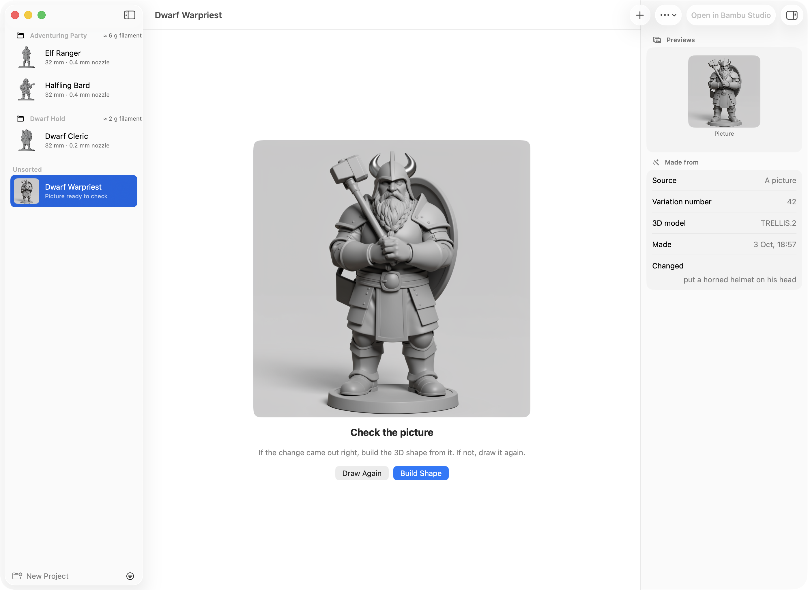

# Versions

A mini doesn't always come out right the first time: a bow goes missing, a pet on a shoulder
turns into a blob. This page is about making it again, lining up a few versions, and keeping
the best one.

## Which one to use

| You want to… | Use |
|---|---|
| Carry on with a mini that didn't finish | **Try Again** |
| Make the same mini again, with a different variation | **Make Another Version…** |
| Keep the picture you like and only make the 3D shape again | **New 3D Shape…** |
| Fix something in the picture, like a cape hiding the arms | **Make Another Version…** or **New 3D Shape…**, with **What to change** |
| Change a setting, the description or the picture, and make it again | **Edit & Make Again…** |
| Have the same shape at a second size | **Duplicate…** |

All of them are in a mini's right-click menu and in the **Mini** menu. Each new mini waits its
turn in [the queue](queue.md), so you can line up several and carry on meanwhile.

## Try Again on a mini that didn't finish

When something goes wrong while a mini is made, its page says **This mini didn't finish**, with
why, and a **Try Again** button. (A new mini you stop yourself is moved to the Trash instead.) Try Again is also in its right-click menu, the **Mini** menu, its
notification, and the progress in the toolbar.

Try Again carries on from the step that failed. A mini is made in three steps: the picture,
the 3D shape, and the print file. A step that already finished isn't done again. So if the
3D shape failed, the picture isn't drawn again, and if only the print file failed, Try Again
takes about as long as a resize.

Try Again makes it with the same 3D model as before. If you've removed that model in
**Settings → 3D Model**, download it again first. If you stop a Try Again, the mini goes back to
how it was, ready to try once more.

!!! tip
    Next to **Try Again** is **Report a Problem…**. It gathers what a bug report needs, with your
    private details taken out. See [Report a problem or an idea](report.md).

## Make another version

Right-click a mini → **Make Another Version…**, then press **Make**. Mimic makes it again from the
same picture or description and the same settings, with a new variation number. The variation
number is what the drawing and the 3D shape start from, so a small detail that came out as a
blob may come out right this time.

The new version goes next to the first, in the same project.

## Make only a new 3D shape

Right-click a mini → **New 3D Shape…**, then press **Make**. It keeps the mini's picture and makes
only the 3D shape again. It's quicker than a new version, and a drawing you like stays as it is.

It's there once the mini's picture has been made. A mini you
[imported as a 3D model](importing.md) has no picture, so Make Another Version, New 3D Shape and
Edit & Make Again are off for it. Resize and Duplicate still work.

## Say what to change in the picture

Something in the picture to fix, like a cape that hides the arms or a sword cut off at the edge?
In **Make Another Version…** or **New 3D Shape…**, type it in **What to change**, for example
*close the cape so both arms show*, then press **Make**.

1. Mimic redraws the mini's picture with your change.
2. Mimic stops and shows it to you: **Check the picture**.
3. If the change came out right, press **Build Shape** to make the 3D shape from it. If not,
   press **Draw Again** to draw it again with a new variation number.

{ width="700" }

The picture waits for you. The list shows the mini as **Picture ready to check**, and its
notification has a **Build Shape** button.

Each version you make with a change starts from the picture of the one before, so changes add
up. Under **Changed before**, the sheet lists what's already been changed. The mini's
**Made from** details list them too, under **Changed** and **Then**.

A change needs Draw Things, or an online service (see [Settings](settings.md)). If you've
chosen an AI helper for descriptions, it turns your words into an instruction for the redraw first ("Writing the
change…"). To change something when you first make a mini, see
[Making a mini](making-a-mini.md).

!!! note
    A change redraws the picture as a grey sculpt. A mini made from a colour picture with the grey
    sculpt off loses its colours in the [export for virtual tabletops](printing.md) once you
    make a version of it with a change.

## Edit & Make Again

Right-click a mini → **Edit & Make Again…**. New Mini opens filled in from the mini: its picture or
description, the grey sculpt, cartoon, sizes and base, project and variation number. Change
what you like and press **Make Mini**.

If you change nothing, the same description draws the same picture. If the mini was made with a
3D model other than the one chosen in Settings, New Mini uses that model again if it's still
downloaded, and says so, with a button to use the one in Settings instead.

!!! note
    A mini made this way is a mini of its own, not a version: it isn't grouped with the first,
    and **Keep This One…** doesn't touch it.

## Duplicate a mini at another size

Want the same mini twice, one for the table and one for the shelf? Right-click it →
**Duplicate…**, name the copy and press **Duplicate**. Resize opens next, to choose the copy's size.
Only the print file is made again, in about a minute, and the shape stays exactly the same.

The copy isn't a version, so **Keep This One…** never moves it to the Trash. Changed your mind?
**Edit → Undo** moves the copy to the Trash. See [Sizes and bases](sizes-and-bases.md) for Resize.

## Compare versions and keep the best one

A mini's page lists its versions under **Versions**, in the details panel on the right. The one
you're looking at is outlined. Click another to see it.

- **Compare Side by Side…** shows two finished versions in 3D next to each other. Turning or
  zooming one turns and zooms both. Choose which version each side shows at the top, and press
  **Done** when you're finished.
- **Keep This One…** keeps the version you're looking at and moves the others to the Trash.
  It's under each side in Compare Side by Side too.

<!-- screenshot: versions-compare.png | the Compare Side by Side sheet: two versions of the same character in 3D next to each other, each with its version picker on top and Keep This One under it, Done at the bottom right -->

After **Keep This One…**, Mimic offers to give the kept version the plain name. For example,
*raven-3* becomes *raven*, since the others are in the Trash. Press **Rename**, or **Cancel** to
keep its own name.

A version that's being made stays where it is. Waiting ones leave the queue. **Edit → Undo**
puts the others back from the Trash.

!!! note
    Versions are grouped when they're in the same project and were made with Mimic 0.6.0 or
    newer. If you move a version to another project, it's no longer listed with the others.

## How versions are named

A new version takes the first mini's name with the next number: *raven* becomes *raven-2*, then
*raven-3*. The number is the next one free across all your minis. A version of *raven-2* is
*raven-3*, not *raven-2-2*.

The name you see follows the name you gave: a version of "Élodie" is shown as "Élodie 2".
**Duplicate…** suggests a name the same way, like "Raven 2", and you can change it. To give any
mini a better name, right-click it → **Rename…** (see [Your minis and projects](organizing.md)).

In Terminal, `mimic make-another`, `mimic make-another --new-shape`, `mimic duplicate`,
`mimic retry` and `mimic keep` do the same. See [Mimic from a terminal](cli.md).
